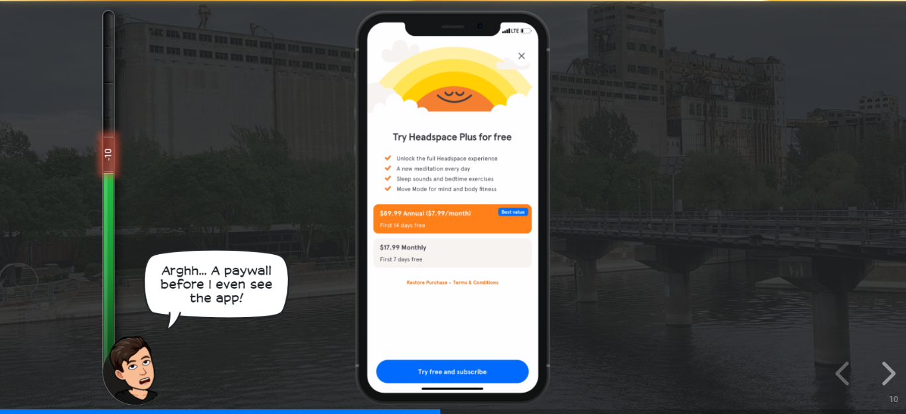
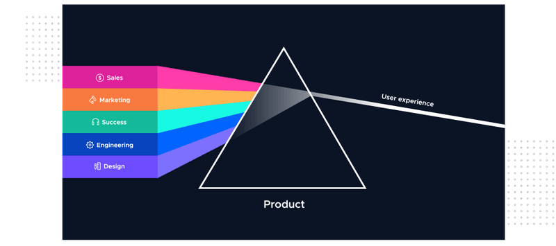

It is hard to fathom now, but there was a time when adopting a new software could take months, quarters, or even years. These days, a communication executive who uses Notion for personal projects can easily introduce her boss to it and convince the whole company to adopt it. We've seen product adoption go from months (or longer) to days and hours based on an individual's initiative. This exact model where the product does the main work of convincing a user to find value, keep using, and refer the product to others is called PRODUCT-LED GROWTH.

Product-led growth is a business methodology or a way of running your business in which the product serves as the main vehicle for user acquisition, activation, and retention. One of the ways to achieve this is by offering a personalized and delightful experience.

[Openview Partners](https://openviewpartners.com/product-led-growth/#.XTDUWehKhPY) originally coined the term (and came up with this definition) but it has since been used as a growth strategy by many others trying to grow their companies.

_"Product Led Growth (PLG) is a go-to-market strategy that relies on product usage as the primary driver of acquisition, conversion and expansion."_

It means that at every stage of the customer's journey, the product leads the way. With PLG, unnecessary frictions are removed and users are able to get a first-hand experience of the product with no hassle and time-wasting, unlike the traditional model where you have to go through a series of onboarding process, filling of demo request form, credit card submissions amongst other steps before getting value from the product.

It is also pertinent to note that
> Product-led growth ≠ to Product Management-led growth.

PLG creates a company-wide alignment towards the product in which customer success, engineering, product, design, marketing, and every other department are all on the same page about the product being the major driver of growth.

## 3 PILLARS OF PLG

### 1. Design for the end-user

A user-first approach cannot be overemphasized in building a product that solves your users' pain-points. All through your product lifecycle, your end-user should constantly hold the driver seat of your product (vehicle) and not prioritize formal ROI over them.

Tony Xu (CEO of DoorDash) and his co-founders for instance became drivers with logistics and delivery companies in the earlier days of DoorDash so that they can understand better the delivery problems that restaurants (who were their major audience) were facing. Putting themselves in their user's shoes shows how passionate they are in solving their user's needs.

While you might not have the luxury to do this, you want to make sure you interview your users (if you have an existing product) and early adopters/people who are regularly faced with the problem that you are trying to solve (if you are building a new product). Allow them to do the talking while you listen to understand and get more insight into how better you can tailor your idea/product to solve their need.

### 2. Deliver value before capturing value

PLG companies prioritize a short Time To Value (TTV). This means they want users to experience their product as quickly as possible without unnecessary stalling. This is often accomplished by providing a trial account or freemium subscription model rather than prompting users to give their credit card information before getting any value from the product. The latter requires users to take some risk on a product that might not solve their problem. This creates discontent for the user and ultimately leads to churn and bad PR.

<figure>
  
  <figcaption>A paywall during headspace user onboarding (Credit: <a>growth.design</a>)</figcaption>
</figure>
  

### 3. Invest in the product with go-to-market intent

The main reason why you want to switch to PLG is so that your product serves as the proof point during your user acquisition, activation, and retention. You, therefore, want to make sure that these metrics are being thought of even in the product development process. PLG helps to reduce the marginal cost of distributing software, enabling users, and capturing value unlike doing it with professional services.

## PLG vs sales & marketing-led growth:

Outstanding customer experience has always been the key to success. Before now, this experience was owned by sales. If you were to buy a product, you'd talk to a salesperson. If you were lucky, they were empathetic and communicated the product effectively such that you bought it and it solved your pain points.

But what PLG does is that it puts the product on the user's hands as soon as they request it.

It is important to note that PLG does not sideline or rule-out sales and marketing efforts. It only reduces the pressure and weight on them and helps them to carry out their work more easily and communicate product values seamlessly.

Communicating your product value is at the helm of a Product-Led Growth strategy. Sales-led companies love to hide their pricing behind closed doors, asking potential buyers to request a quote. Product-led companies remove this bottleneck and unnecessary friction with up-front pricing for their plans.

With PLG, all departments are aligned towards one major goal which is making the product the proof point of the business, unlike sales-led organizations where departments are separated into:

The team that builds the product (Product and Engineering); and
The team selling the product aka the profit center which will mostly include Sales, Marketing and Success.

The shortcoming with the sales-led structure is that the product is usually a second-thought for the profit center teams and this creates a gap in proper dissemination of sales and marketing insight to products and engineering.

It is useful to note that PLG is not limited to Business to Consumers (B2C) only. [According to Forrester](https://go.forrester.com/blogs/16-02-10-how_self_service_research_will_change_b2b_marketing/), 3 out of every 4 Business to Business (B2B) buyers would rather self-educate than learn about a product from a sales representative. This is why Product-led companies are gaining more traction in terms of user acquisition, activation and retention. This strategy has therefore been able to limit wait time and do the heavy-lifting of putting the users up to speed with the product and consequently increasing the time to value (The time it takes a user to get value from a product) of the product. Likewise acquisition, activation, and retention.

## Examples of Product-led companies

[Calendly](https://calendly.com) for instance minimizes friction in their onboarding process and gets the user to try out their product in a few minutes as seen in the slideshow below.

<figure class="video_container" style="text-align: center">
 <iframe width="560" height="315" src="https://www.youtube.com/embed/xROYeThUJ8k" frameborder="0" allow="accelerometer; autoplay; clipboard-write; encrypted-media; gyroscope; picture-in-picture" allowfullscreen></iframe><figcaption>A short clip showing some PLG practices in Calendly onboarding process.</figcaption>
</figure>
  

The company prioritizes the user's need which is to schedule meetings and did not get in the way with any unnecessary feature, they also kept to their promise of not asking for your credit card details till you're ready to be a paying user. All this is to the end that you the user get your hands on the product seamlessly and get value from it as quickly as possible.

Dropbox, Notion, Slack, Airtable, Atlaissan, Figma, Typeform, Zoom, Surveymonkey, Dropbox, Twilio, Shopify are some other great examples of PLG companies. They all have the following characteristics in common:

1. You can get started on any of them in a few minutes and get value out of it.
2. There is less friction in the onboarding and entire customer journey.
3. Their solution is tailored to solving a particular pain-point.
4. You commit to pay when you are ready to.

We have also started seeing other enterprise companies like HubSpot who were sales-led switch to PLG and there are predictions that more sales-led companies will make this transition in this new year considering the success made by PLG companies in 2020 amidst the global pandemic.

## How to transition to product-led.

PLG companies are able to grow faster and are more effective by leveraging their products to create a pipeline of active users that are converted into paying customers.

PLG is more than a simple Go-to-market formula. It is a product culture.

To transition to PLG, you need to have an incredible product that delivers on the value promised. Don't just overpromise, deliver on your promise. As empathy and innovation are inherent in design-led thinking, so it is with PLG because a well-designed product is a requirement for PLG. Well-designed doesn't just mean aesthetics but how frictionless and intuitive a product is such that it achieves sticky features and a short time to value.

To achieve an engaging product experience that is capable of demonstrating its own value, the team needs to understand the customer journey and the pain points that they are trying to solve. As you probably know before now, your product should be built around the user's problem and not your assumptions.

In solving these problems, you want to make sure that you don't add to the problem they already have by offering products with unnecessary features that are not targeted at solving the problems. You also want to remove these pain points wherever possible and offer effective user onboarding that is centered around the user goals (not product features) and provide ongoing, contextual in-app or monthly newsletter communication for app and web-based products respectively.

<figure>
  
  <figcaption>Product-led Prism depicting how all the team work together to achieve one aim - intuitive UX (Credit: <a>productled.org</a>)</figcaption>
</figure>
  

In making this switch, you have to come to terms with the fact that users prefer self-education to being told what to do. Transitioning to PLG requires more alignment, dedication and effort from every single person in the company to ensure that the product remains the viral growth element of the business that ultimately delivers a compelling and delightful experience.

Clearly, PLG is not a "set it" and "forget it" strategy. It is not a quick fix and you will require all the work needed to make it work.

Please, Feel free to share what you think and what your experience has been using PLG. Happy to learn from them.
 

Thanks to [Praise Mbanali](https://www.linkedin.com/in/praise-mbanali-27229115a/) and [Olabinjo Adeniran](https://www.linkedin.com/in/olabinjo/) for reviewing this article.

---

## Sources:
- [Hero Image by Markus Spiske on Unsplash](https://medium.com/r/?url=https%3A%2F%2Funsplash.com%2Fs%2Fphotos%2Fgrowth%3Futm_source%3Dunsplash%26utm_medium%3Dreferral%26utm_content%3DcreditCopyText)

- [What is product-led growth? by Product-Led Growth CollectiveWhat is product-led growth? by Product-Led Growth Collective](https://www.productled.org/foundations/what-is-product-led-growth#Chap2)

- [What Is Product-Led Growth: A Definition & Why It's Taking Off? by Wes Bush](https://productled.com/product-led-growth-definition/)

- [PRODUCT LED GROWTH Fueling the fastest growing software companies. by Openview Partners](https://openviewpartners.com/product-led-growth/#.X_ylCuhKjIV)