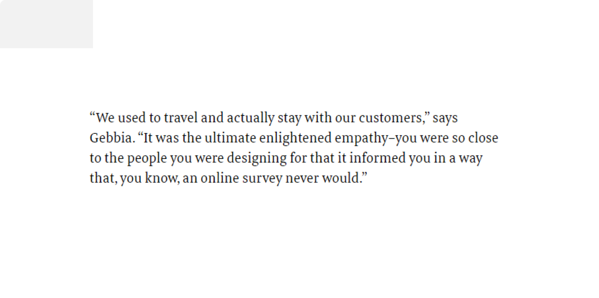

Product discovery is the process of figuring out what needs to be built. It validates your vision and answers important questions like: 

- Is this problem worth solving
- Will our solution work
- Will people pay for it.

As defined by [Mixpanel](https://mixpanel.com), product discovery is a method of deeply understanding your customers to develop products that perfectly suit their needs. 
It is a critical stage in the product design process because If companies do not accurately prove or disprove their assumptions about their customers, they may waste time building products that nobody needs.   
Product discovery involves validating an idea you have by interviewing the users and try to understand their needs and wants, goals, and motivations. It is good to note that Product discovery is a team sport, The process should include folks across different user-facing departments like development (engineering, design, QA, UX), marketing/sales, customer success, and product. This helps you leverage their knowledge and expertise to build rapport, and create support for key product decisions. (A developer for instance might help quantify the technical feasibility and vulnerabilities of a feature, while a UX designer will help to better study and interview users).

The product discovery process is crucial because it puts the teams in the customer’s shoes to enable them to build a product that is vital to the customer’s need and not a mere “nice-to-have” product. 
Without qualitative and quantitative insight to validate or invalidate your assumptions, you might be wasting lots of money, time, and resources on an unreasonable and unattainable goal.

## CONDUCTING PRODUCT DISCOVERY  

It is advised that product discovery is timeboxed especially for new products (This does not mean that the process needs to be rushed). Timeboxing your discovery process means setting a timeframe for it after factoring in various risks. If the discovery work is not completed after the specified period, you can either add another time box or stop the discovery process. This helps you to do meaningful work and not get caught up in the validation depth. It also helps in getting the product to the market quickly and getting actionable feedbacks that can drive the next iteration.
In conducting product discovery, you have to think beyond the four walls of your company/home - It’s time to hit the street and get some raw actionable insights from real people. However, this might not be possible in a pandemic like COVID. Utilizing product discovery tools (listed below) can help bridge this gap.

### Define your “why”

Highlight the goal of the exercise and get everybody on the team on board with it before starting the discovery work. Mapping out the "why" will always keep you in check to stay within the scope of the discovery. You also should make sure that the scope of product discovery is in line with the company’s goal.

### Know your users/audience.

You need to discover whether there are real users out there that want this product or people that have this problem that you are trying to solve. This helps you to know early if the idea is worth venturing into. Knowing your users goes beyond just highlighting a bunch of people who have encountered the problem as some of these people are probably nonchalant about the solution you have to offer. Your users are those who encounter this problem on a regular basis and are passionate about solving it.
Once you know your audience, segment the market and know who your primary and secondary segments are. It will help you know who you are not serving. Choosing who you will not serve is just as important as knowing who you plan to serve. 
Eventually, you can choose to expand but start with a subset and a place you are likely to win.
For instance,  In the earlier days of Lyft, the co-founders didn’t interview every single person that might be experiencing issues commuting but rather interviewed the set that is likely to encounter it on a daily basis - College students. 

Creating a friendly ambiance around your users can also be very helpful in driving a meaningful conversation with them. As one trying to solve a particular person’s problem, you want to be “close” enough to the person to establish a perfect ground around the problem. If you were building a solution to help creatives monetize their craft, for instance, amongst other things that you would do, you would want to follow as many on Instagram, Youtube and activate post notification for quick updates.  Establishing this ground does not mean that you have to precariously intrude on the person’s privacy. Showing that you really care about the problem might be a signal for your potential user to open-up for an insightful conversation.
Having a clear audience means you can focus your efforts on their needs first, and then expand from there. 
>>> Like [Deb Liu](https://www.linkedin.com/in/deborahliu) puts it, “Before you build for the world, win in one market. You can later take the capabilities you built and move to adjacent verticals or experiences”.

[Suggested watch: How to talk to users by Y Combinator partner, Eric Migicovsky.](https://www.ycombinator.com/library/6g-how-to-talk-to-users)

### Focus on problem validation, not solution building. (Be open to learn, unlearn and relearn)

Be flexible with your idea as the product discovery process can either validate or invalidate it. Sometimes, you might have to go back to the drawing board and build something different from your initial idea. This happened to Kevin Systrom who initially built Bourbn (a check-in app) but had to kill it for a photo-sharing feature on the app after discovering that no one was interested in checking in their locations but more people loved the photo-sharing feature which later became Instagram.
[Enlightened empathy](https://www.fastcompany.com/3023403/how-joe-gerrbia-and-airbnb-conquered-the-trough-of-sorrow-with-enlightened-empat) as described by Joe Gebbia of Airbnb is seeing the world so closely in the shoes of the person you are creating for, that you could see the world the way they see it. With this, you combine the insight gotten with your own-design point of view to create something new.

<figure className="Image__Small">
  
  <figcaption>Joe Gebbia on how Airbnb conquered the "Trough of Sorrow" with enlightened empathy (Credit: <a href="fastcompany.com">Fastcompany</a>)</figcaption>
</figure>  

Joe and his co-founder Brian Chesky would go from house-to-house in Brooklyn Manhattan part of New York to take pictures of the homes on the site (AirBed and Breakfast). When invited to stay over for coffee, They’d gladly oblige and utilize this period to achieve enlightened empathy with the user. Through this, They were able to see how their perfectly designed interface completely failed when they asked the users to show them how they view listings and calendar on the website and was surprised to see how what they thought would take 2-3 clicks to get done was taking people about 10-12 clicks to complete.

### Define success upfront - What will winning look like?

Set a target for yourself and define what success will look like at the end of the product discovery. It is advisable to also set some timeframe around this. Popular metric system that you can use is OKR and KPI.

[Suggested resource: OKR Templates](https://okrtemplates.com/)

### Stay safe - utilize tools for product discovery

Utilizing software tools to drive product discovery has never been this required. Since the coronavirus pandemic hit, we have all found ways to digitize our processes and this applies to product discovery as there are a couple of tools that can be helpful in this process. 

- #### Note-taking:  

&nbsp; [Google docs](https://docs.google.com), [Notion](https://www.notion.so/), [Evernote](https://evernote.com).  

- #### Usability Testing:

&nbsp; [UserTesting](https://www.usertesting.com/), [Feedback loop](http://feedbackloop.com/), [UserZoom](https://www.userzoom.com/). 

- #### Wireframe & Prototype:  

&nbsp; [Figma](https://www.figma.com/), [Invision](https://invision.com), [Framer](https://www.framer.com/). 

- #### Video chat/Async Comms:

&nbsp; [Zoom](https://zoom.us/), [Google Meet](https://gsuite.google.com/products/chat/), [Loom](https://www.loom.com/). 

- #### Product Analytics:  

&nbsp; [Mixpanel](https://mixpanel.com/), [Google Analytics](https://analytics.google.com), [Heap](https://heap.io). 

- #### Surveys: 

&nbsp; [Google Forms](https://www.google.com/forms/about/), [Typeform](https://www.typeform.com/), [Airtable](https://airtable.com/). 

### Identify risk - What are the pitfalls?   

Beyond talking to users, you also want to use this period to evaluate if there is a thriving ground for your idea or not. Identifying big risks that need to be tackled during the discovery phase is important as no one wants to invest resources and money in a wasted venture. Some of these risks include:

- Financial risk – can we afford this solution?
- Sales risk – is this solution compatible with our go-to-market strategy?
- Legal risk – is this solution something we can legally do?

If you’re a startup in Nigeria, you definitely should include Regulatory risk on the list because the earlier you factor this in, the better it is for your company.

Product discovery is important for any new feature you want to build even on an existing product. In product discovery, talk to your users. Not the general public. 

Product discovery is also a continuous learning process - It does not end after understanding your customers' needs. 

_Your product discovery work should focus on nailing the value proposition, target group, business goals, business model, and stand-out features of the product—not on writing user stories, designing the user interface, or building the actual solution. Your goal should be to mitigate the risk of building a product nobody wants and needs, not to figure out the product details_ - [Roman Pichler](https://www.romanpichler.com/)

The goal of product discovery is not necessarily to ship features. Rather, it is to promote an environment of learning that will help you improve your product incrementally and consistently.

Thanks to [Nifemi Oluboyede](https://www.linkedin.com/in/nifemi-oluboyede-91258861) for reviewing this article.

## Resources:

1. [Product Discovery Tips by Roman Pichler](https://www.romanpichler.com/blog/product-discovery-tips/)
2. [Best Practices for Developing a Product Strategy by Deb Liu](https://debliu.substack.com/p/best-practices-for-developing-a-product)
3. [Product Discovery 101 for Product Managers by Product School](https://productschool.com/blog/product-management-2/product-discovery-101-product-managers/)
4. [Guy Raz Interviews Joe Gebbia of Airbnb on How I Built This Podcast](https://www.npr.org/2017/10/19/543035808/airbnb-joe-gebbia)

