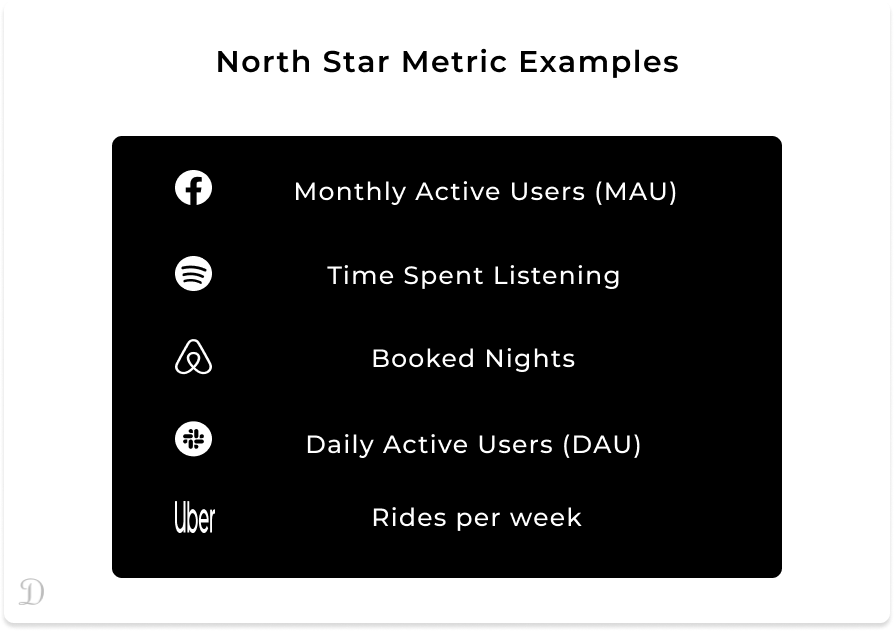
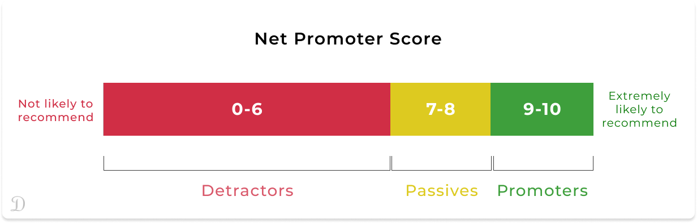

Being able to tell what's working from what is not is crucial in defining the success of a product. This enables product leaders to prioritize plans and initiatives properly. Making a decision on what your success metrics will be is as important as the product discovery phase as there are a lot of metrics to track and not clearly defining your success metrics can be misinforming. 

Metrics are grading or evaluation systems used to measure the level of success or failure of a product/feature. They vary from those that impact the business directly to the ones that impact customers and the product itself. Product managers are often particular about getting their metrics right as this is how they are able to provide data-driven suggestions and product plans to stakeholders and executives.

> Metrics makes it easier to earn executives' approval.

## CHOOSING THE RIGHT METRICS

What is the one metric that matters most to the success of your company and that you can rally your team around? For Facebook, it is active users; for WhatsApp, it is the number of sends; for PayPal, it is total payment volume. Once you identify this "top-line" metric, you can set success criteria around it, monitor it, understand what drives changes in it, obsessively push it in the right direction - and properly evaluate and manage the health of your product.

Not properly aligning your metrics to your product goals can put you in a position where you want to track all the metrics you could measure. Doing this will mostly end up with you measuring a lot of "vanity" metrics that might make you feel good but don't actually help you to make decisions. What metric you keep an eye on will depend on your business strategy, the industry you are in, and what stage of growth you are in.

Fundamentally, your choice of metric should be driven by your product vision and the company's mission.

Success metrics have an actual impact on the business and provide meaningful insight for decision-making. An example is the number of converted audiences from a campaign while a vanity metric will be the total campaign reach. As interesting as the number of reach sounds, it does not provide you with any actionable insight. On the other side, a number of converted audiences from the campaign can help you make further decisions.

## NORTH-STAR / KEY / TOP-LINE METRICS

It is advisable to maintain a close set of key metrics or top-line metrics. Some organizations utilize the north-star metric (The key measure of success for the product team in a company) which has the ability to adapt to product changes. However, the north-star cannot be isolated as it works alongside other product metrics.

Brian Balfour of Reforge suggests that most products should have 4 high-level metrics. An acquisition, retention, engagement, and monetization metric. These 4 act as a system where one can influence the other.

In choosing Key metrics, [Shreyas Doshi](https://twitter.com/shreyas) suggests the following criteria:

- It must be responsive to product changes.
- It's an aggregate measure of the product's value for its users.
- It can be readily tied to business value.
- It's expected to be long-lasting (at least two to three years).

 </img> 

Key Metrics give a great high-angle view of how the product is doing.

## Business Metrics

This involves metrics that impact the health of the business itself - How is your company doing in terms of acquiring and retaining customers? How much money is coming in? These are the types of questions you can answer with these common business metrics.

Metrics that fall into this category include:

### Customer Acquisition Cost (CAC):&nbsp;

  This measures how much you spend to acquire new customers. It is the total cost of sales and marketing efforts, as well as property or equipment, needed to convince a customer to buy a product or service

A basic way of calculating CAC is by dividing the cost of sales and marketing by the total number of customers acquired over a given time.

>>> CAC = MCC / CA

Where MCC is the total marketing campaign costs related to the acquisition, CA is the total customers acquired.

### Customer Lifetime Value (CLTV):&nbsp;

 CLTV estimates how much revenue a customer represents to a business over the life of that relationship. It helps you to put a price tag on your users.

>>> CLTV = Average order value x Purchase frequency x Average lifetime

### Monthly Recurring Revenue (MRR):&nbsp;

 This is an estimate of the revenue generated per month. It helps to keep track of how you're doing. It's also an important number to be able to share with stakeholders and shareholders as MRR presents a quick overview of how the business is doing.

### Churn:&nbsp;

 Churn is a way of measuring how many customers you're losing and it helps you understand your customers' journeys and successes within your product.

It is important to note that what counts as churn will depend on your product. Scholarship prep apps are sometimes uninstalled because they have served their purpose; users have finally secured their dream scholarship and admitted to their dream school.
> Not all products are designed to be used for the rest of their user's lives!

## PRODUCT USAGE METRICS

Product usage metrics help you look a little more closely at the actions users are taking. These tend to be measurements of things that a product team has more direct influence over than the business metrics.

These includes:

### NPS & CSAT Scores:&nbsp;

 Net Promoter Score (NPS) and Customer Satisfaction Score (CSAT) are great ways to measure the sentiments of your users.

 

Your NPS score, in a nutshell, tells you how well your product is loved by users. It helps you segment your users into 3 categories based on how they rate your product out of 10.

### Activation:&nbsp;

 Activation measures the number of people who have started to use your product or service and found initial value. The exact definition of activation will vary depending on your business. For a ride-hailing app, it is when you order your first ride and not signup. It might also refer to the moment when someone switches from a free trial to a paid subscription for the first time.

Time to Value (TTV) which is the time it takes a user to derive value from a product is a great way to measure activation.

### Retention:&nbsp;

 At the product level, retention means that people regularly come back to use your product. Some common examples include someone purchasing from you multiple times, regularly opening or using your app, or renewing their subscription with you.

### Referrals:&nbsp;

 Referrals measure how well you are able to turn your customers into your product evangelist by monitoring how many people they bring in. With this, you can gauge how many customers you are getting against paid acquisition. Most startups incentivize this technique as it has proven to be a good and affordable/low-cost acquisition model.

### Conversion:&nbsp;

 This answers the question of How many people who land on your website or app do what you want them to do? Whether it is to sign-up, upload photos, or stream your content. It helps to identify key drop-off points for users in their journey and inform you of features that may not be working.

### Engagement:&nbsp;

 Engagement tells you how frequently and in what ways people are using your product. It's a way to determine whether they've formed a habit of using it and if they're getting regular value out of it.

Depending on the product and the expected frequency of use, you can break this down into daily active users (DAU), weekly active users (WAU), or monthly active users (MAU). Another metric that helps you assess engagement is **stickiness**. It is very easy to desire to track DAU even when your product is only needed by users occasionally. Grubhub for instance will not track DAU since they don't expect users to order food every day while DAU will sound great for Duolingo to track since they want you to practice that language every day to become good at it. So, it is imperative that you know and define your success metrics and not fall victim to tracking all that there is to track in your product analytics tool.

Choosing the right metrics and rallying your team around it is not an easy task. It is a learning process where you allow your choice to be influenced by your product strategy, the industry you play in, and your company's mission. It is also advisable to be flexible with your choice of north-star and success metrics such that it is easy to make adjustments and realign your metrics to the unavoidable changes in your industry or market.

The only way you won't abuse "data-driven" is by clearly highlighting and separating your success metrics from your "feel good" metrics  -  This ultimately will help you to make data-informed decisions and earn stakeholders' approval easily.

_Found this article insightful? Kindly share with others and please, subscribe to my mailing list to always get product articles like this in your mailbox once a month._

---

Thanks to [Eko Adetolani](https://eko-adetolani.medium.com/) for reviewing this.

### SOURCES:

- [A Primer on Product Metrics by Shreyas Doshi](https://mixpanel.com/blog/shreyas-doshi-product-metrics/)
- [Every Product Needs a North Star Metric: Here's How to Find Yours](https://blog.amplitude.com/product-north-star-metric)
- [Defining Product Success: Metrics and Goals - Sequoia Capital](https://www.sequoiacap.com/article/defining-product-success-metrics-and-goals)