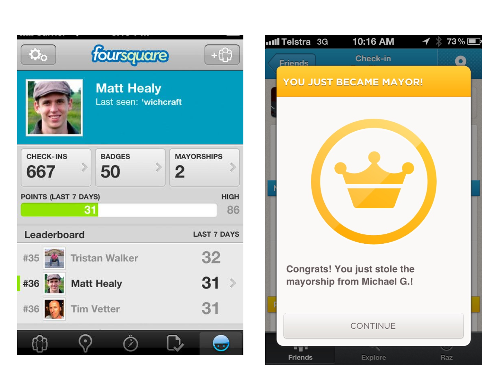
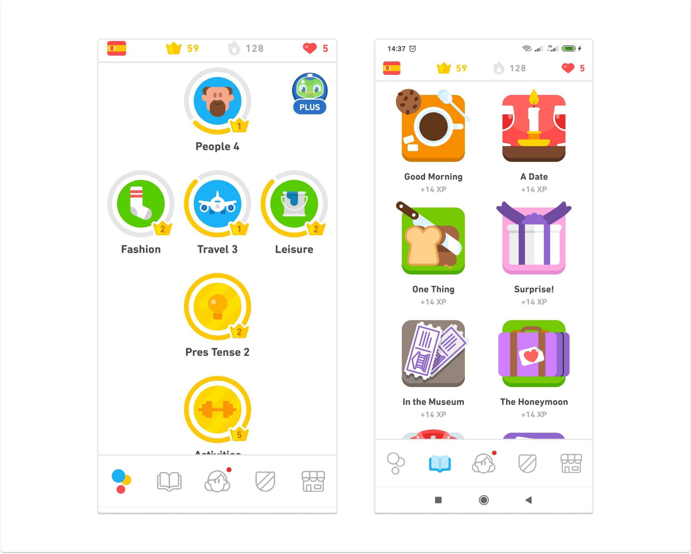
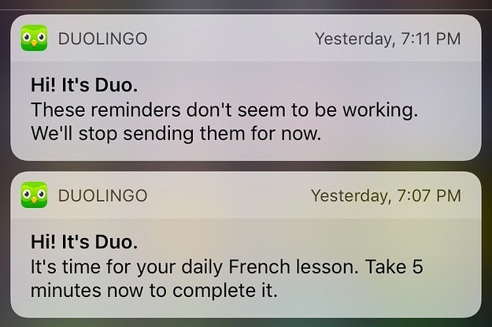
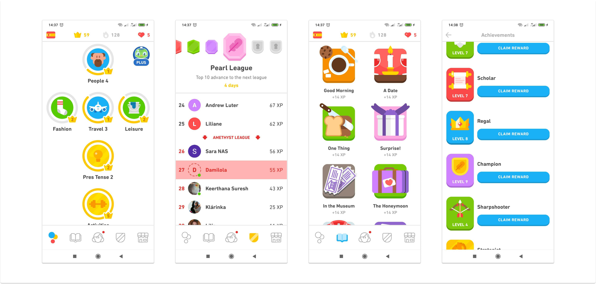

It's 2021 and there are millions of apps out there and a number of them are competing with you for the same user's attention and engagement. This is coupled with the fact that users on their own don't have much longsuffering to retain an app if it is not solving their need or motivating them to do likewise. These days, most spaces/industries are congested with several options to choose from, leaving the users with the autonomy to make a choice.

Gamification is the use of game-design elements and principles like streak, points, leaderboard, etc, to reward users' behavior in a non-gaming environment. While the term itself may have been coined in recent times, the technique has been around for a while and explored by non-tech businesses like Starbucks. The first well-known tech company to leverage gamification is Foursquare (the check-in app) such that if you checked into a location, you would receive points. Check-in to a new location, you hadn't visited before and you would receive even more points. You could then compare the number of points you had on a leaderboard with friends and you could also receive badges for doing special things like checking in on a boat or checking in with more than 50 people in one place. If you checked into a place more than anyone else, you became the "Foursquare mayor" of that location.

  

Gamified experience is a [delighter](https://www.damilolaa.xyz/delighters-the-wow-feature-set) - a nice to have a feature that enables users to engage better with your product. It should however not be mistaken for a must-have feature. There's no rule of thumb that says all apps must employ gamification to be valuable, so you might as well not need one if your users are deriving value from your product and are motivated to continue likewise.

Gamification helps to make important and seemingly strenuous tasks enjoyable and has proven to be useful as many tech unicorns and startups utilize it to increase their customer engagement. The likes of Duolingo, KhanAcademy, Fitbit, Todoist, Cowrywise, and Strava to name a few, are all gamification advocates.

However, there are also pitfalls to gamification and it has led some tech giants, who were once seen as masters of the craft, to fall prey to these pitfalls. The technique can easily go from amazing to frustrating if not executed properly.

> Gamification shouldn't take your users off the main essence of your product that they start thinking of your app as a game. 

If this happens, you probably have taken things too far and should consider redesigning your product experience.

# HOW TO APPROACH GAMIFICATION

### Understand your user's behavior: &nbsp;

The first thing to do before thinking gamification is to know how your users are using your app; what motivates them to use it, why do they love using it, and if they've gone nonchalant that they no longer use it as before. You should ask what has changed also. Deep diving into your user's behavior and understanding what motivates them to engage with your app is key to determining what you need to improve upon. 

This will inform you if gamification will work or not. In some cases, users became uninterested simply because they encounter a recurring technical glitch that delays them from completing tasks on the app. This kind of user would care less about gamifying the experience as all they really want is a bug fix.

It's important to always be reminded that building a user-centric product requires putting your users at the forefront of your decision-making.

### Draw a thin line between gamification and your product value:

Having started with gamification, it may become hard to resist the temptation to gamify your app more and more until it actually looks like a game. If you're not careful, you will find your users lose focus of the main reason they initially onboarded on your app and start submitting feature request that is geared towards making your app the new Candy Crush. To mitigate this urge, your choice of gamification elements should be influenced by your product value and goal. You might not need to include a leaderboard - For instance, maybe all your users need to remain motivated is just a badge or points that show them some sort of reward.

Likewise, if you're trying to improve conversion with gamification, your choice of game element should be able to engage the users so much that they no longer bother to see a short ad at the end of an important task or be willing to pay you to turn it off.

On the flip side, if your app's target audience is users that need to quickly find or learn something, do not overload your product with difficult tasks and levels. When the users get stuck on one of those levels, they can lose interest and quit. Make the gaming elements optional, as not everyone may be interested in collecting points and earning badges.

### Break down big tasks into smaller units:

  

Since Duolingo understands that learning a language is nebulous especially when done online, unlike their competitor Rosetta Stone whose lesson is between 5–10minutes, they launched a 3-minutes gamified lesson and short stories to make the journey to learning a language simple, enjoying and rewarding for their users. They got most of their users engaged on the app solely because of this technique of breaking lessons down into smaller chunks and following a level-up pattern in progress tracking.

### Regularly motivate users to complete goals (Nudge but don't nag):

  

Duolingo wants their users to use them every day so they developed a sophisticated AI system that sends daily notifications to users with some very interesting copies through email and push notifications. If users don't react to any of these notifications after 5 days, they send a follow-up mail stating that the notifications seem not to be working and that they will be discontinued for a later time.

According to the founder, Luis Von Ann. This technique has been instrumental for their user's retention as it holds the user accountable and gets them back to using the app.

Even if an AI system is not what every company can afford, you surely can still motivate your users to regularly use your app by knowing when best to send a notification and what to say in them.

### Reward users for every milestone:

  

Like a parent praising their child for good behavior, you should reward users for hitting targets and for successfully completing challenges. Everyone likes a bit of praise, and even if the reward might not have any intrinsic value, sometimes just saying well done can make a real difference.

# Conclusion

Gamification is becoming a ubiquitous part of product design. When it is done correctly, it can be an effective way to keep your users engaged and make accomplishing necessary tasks more enjoyable. When done poorly, it can be distracting and gimmicky. To avoid this, focus on how gamification examples can support your users in their journey through your app, rather than offering them a distraction for the sake of entertainment. This can be done with the help of the [cognitive flow principle](https://www.gamasutra.com/view/feature/166972/cognitive_flow_the_psychology_of_.php?print=1) that game developers use.

Lastly, don't feel as though you have to stick to one formula just because of other products in your vertical offer something similar. Try something new, experiment, and listen to user's feedback.

A reminder that you should exhaustively test your initiatives with user segments before launching live. With trial - and perhaps a little error - you'll figure out the right amount of gamification for your product.
 

_Found this article insightful? Kindly share with others and please, subscribe to my mailing list to always get product articles like this in your mailbox once a month._

---
Thanks to [Evans Akanno](https://twitter.com/evansakanno) and [Mudia Imasuen](https://twitter.com/imasuen_design) for reading drafts of this.

## Sources:

1. [Understanding gamification: A winning strategy for better user engagement - Appcues](https://www.appcues.com/blog/getting-gamification-right)
2. [What is gamification - Gamify.com](https://www.gamify.com/what-is-gamification)