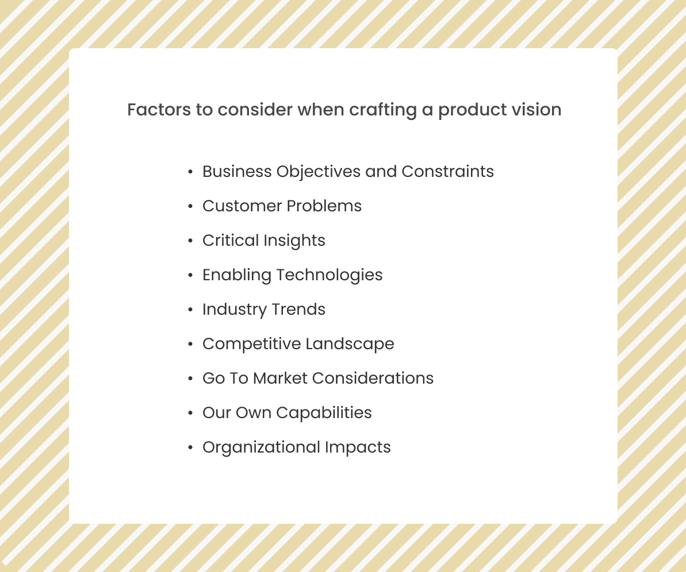

_👋🏾 Hi there, this is the beginning of a product documentation series that I will be sharing in the coming months. Starting with Product Vision, I will also be writing on the product roadmap, product requirement document, go-to-market strategy, and some other important documents often used in product management._

Having an idea about a product is not enough. There has to be a motivation behind the idea that drives you to always want to be successful at it. A product vision inspires you and your team by communicating the purpose of your product to everyone involved in building it; it helps to provide motivation when there's discouragement (as there always will be) and acts as the product's true north star. Product vision also helps to pass across the reason for your product and its ultimate goal succinctly to the users at their first glance at it.

> A product vision is a long-term, overarching plan for your product, with an articulation of how you will get there. Gibson Biddle

The product vision enables teams to embrace a long-term mindset along with a somewhat flexible, step-by-step approach that helps the team navigate from where it is today to its hoped-for future. A product vision should be inspirational and ambitious and must be driven by your reason for building the product in the first place.

It should answer the question of why you are creating a product and what your company hopes to accomplish with it in the future. The goal is to make your product vision the cornerstone of every decision made about the product and that everybody in the company knows the "why" behind the product.

Some of the most powerful product vision statements come from some of the world's most successful companies. This is not a coincidence. These organizations developed compelling product visions that helped keep everyone on the team steering in the same direction - toward a shared, high-level goal for their products.

For instance, Microsoft's vision (at the time of founding) was to have a computer on every desk and in every home. This vision statement is highly ambitious and would have been perceived as ridiculous in 1975 when the company was founded. 

This is the point of having a product vision; to think beyond your present world and imagine what the ultimate goal of your product idea will be in n+ years (Preferably 2–5years for software companies and 5–10 for hardware companies).

Here are some of the best examples I picked

- **Sonos**: Fill every home with music.
- **Google**: To provide access to the world's information with one click.
- **Instagram**: To capture and share the world's moments.
- **LinkedIn**: To connect the world's professionals and make them more productive and successful.
- **IKEA**: 'To create a better everyday life for the many people.'
- **Tesla**: 'To accelerate the world's transition to sustainable energy.
- **Paypal**: 'That every person has the right to participate fully in the global economy, and that we have an obligation to empower people to exercise this right and improve financial health.

## What Product Vision is not! 

- A vision statement is not a series of initiatives aimed at achieving your goal. There should be a clear distinction between your product vision and product strategy. The former is the overview, vague idea of where you see yourself while the latter is the step-by-step process of achieving this idea.

Product vision is the long-term goal while product strategy is the step-by-step plan to achieve the goal.

It is important to note that the product strategy is dependent on the vision. So it is much needed to have a clearly communicated and understood product vision before setting out to work on the strategy as the vision is what inspires the strategy.

- A product vision statement is not the same as your mission statement. Mission statements define a company's objective and its approach to reach it, while a product vision statement describes where the product aspires to be in the future (near).

- Product vision is also not necessarily the same as the company vision. A company vision is at the company level and it will include all the products and offerings of such organization. For instance, Google (the company) has a company vision while their individual products like Map, Search, Android all have their individual product vision which are all geared towards the company's vision.

For smaller companies or startups with only one product, both the company and product vision can be the same but it is advisable to differentiate them to avoid limiting the company's potentials to its flagship product scope only in the nearest future.

## Crafting a compelling product vision

According to Marty Cagan, it is important to check these factors while crafting your product vision.

 
 
  

Roman Pichler also suggests that the following questions be answered in crafting a product vision.

- Who is the target audience?
- Which customer needs can the product satisfy?
- Which product attributes determine the satisfaction of those needs?
- Who is competing and how do they perform? (internal, external competitors)
- What timeframe and product development budget determine the project?

You can use Marty Cagan's [product vision FAQ](https://svpg.com/product-vision-faq/) and Roman Pichler's [product vision board](https://www.romanpichler.com/tools/vision-board/) to craft your product vision.

Since product vision is an essential piece in making your product a success, it is important to carefully craft it. A good way to achieve this is not to do it alone or in silos, else you will be the only one who is aligned with the vision while others remain unsure and struggle to share the vision with you. In my experience, I try to make this phase as interactive as possible by involving all team members across all departments to get insight and contributions and to ensure that everyone is aligned to the vision.

For larger corporations where you cannot involve everyone, it is advised to have the founder(s), executives, and representatives from development, customer support/success, marketing, sales, product, and other teams in the product vision discussion. This helps to get cross-functional opinion and alignment towards the vision as this is essential in keeping everyone motivated and involved in the product development.

Beyond keeping key team members in the discussion, you have to keep reminding them of the vision even when the product has been launched and you're iterating because people tend to forget things a lot and start falling out of the scope/goal of the product.

## What next after creating a product vision

### Regularly Communicate the vision 🔊

This could be through quarterly product strategy meetings. In fact, you can find a way to chip this in at the beginning of every product meeting you have to keep everyone reminded. Large tech corps have also learned from the traditional model of pasting the product's vision (not company vision) on the walls of their respective team's corner/office. Some add it to their email signature. This ultimately helps to remind both investors and team members of how big the opportunity may be.

> If you are working on something exciting that you really care about, you don't have to be pushed. The vision pulls you - Steve Jobs

Crafting a compelling product vision that is user-centric and serves as the organization's north star helps to set the tone for an insightful product strategy phase where the company's approach to achieving this overarching goal is planned and strategized.

It is important not to see the product vision phase as one-time but one that should be visited intermittently. It is advised to review it every quarter or year (as the case may be) and create proper alignment and adjustments wherever needed.

When this phase is well thought out, it makes the product strategy and road mapping stages hassle-free and creates alignment between the company, team members, and the users.

 

_Found this article insightful? Kindly share with others and please, subscribe to my mailing list to always get product articles like this in your mailbox once a month._

---
Thanks to [Seun Runsewe](https://twitter.com/srunsewe) for reviewing this article.

## Resources:
1. [Hero Image by Jukan Tateisi](https://images.unsplash.com/photo-1502101872923-d48509bff386?ixid=MnwxMjA3fDB8MHxwaG90by1wYWdlfHx8fGVufDB8fHx8&ixlib=rb-1.2.1&auto=format&fit=crop&w=889&q=80)
2. [Tips for writing compelling product vision - Roman Pichler](https://www.romanpichler.com/blog/tips-for-writing-compelling-product-vision/)
3. [Five answers to questions about product - Gibson Biddle](https://askgib.substack.com/p/five-answers-to-questions-about-product)
4. [Product Vision vs Product Mission - Sillicon Valley Product Group](https://svpg.com/product-vision-vs-mission/)