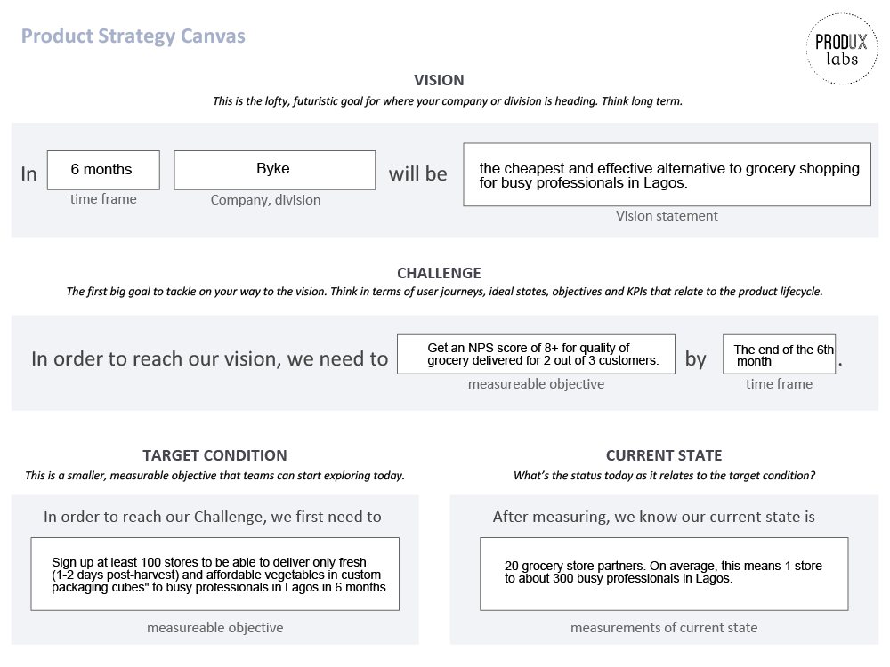
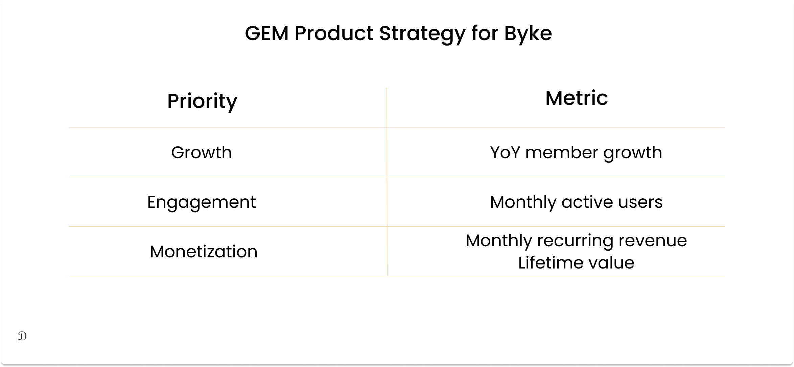
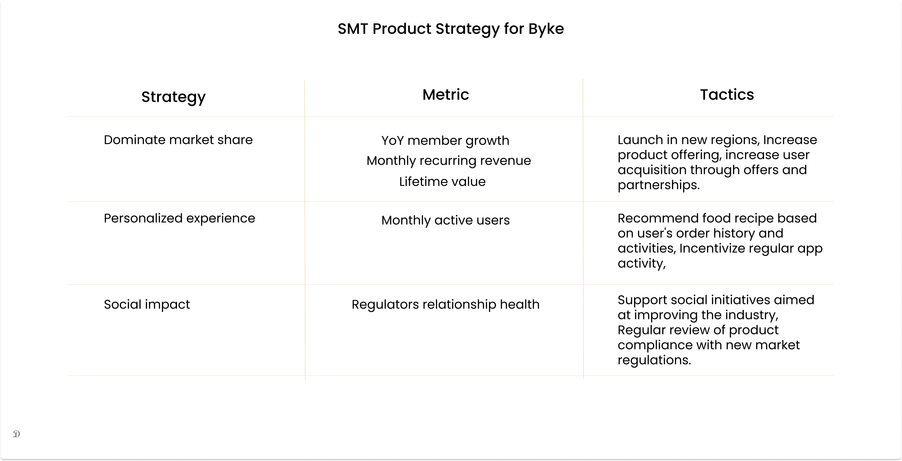

As companies grow, product strategy helps teams to maintain focus and alignment on product decisions. Product strategy is a high-level plan that highlights how you want to achieve your [product vision](https://www.damilolaa.xyz/product-documentation-series-product-vision) or overarching goal.

Product strategy informs your product roadmap and communicates your product plans to your investors, team members, and ultimately your users.

A well-thought-out product strategy sets the tone for a successful product roadmap. It ensures that your roadmap is made up of initiatives that matter to the users and the business. It also helps to create a consensus on the company's approach to feature prioritization.

At the strategy stage, the product manager ensures that only initiatives that help the company achieve its goal are prioritized, else it will not be considered. As with many product management practices, it is important to include key stakeholders from (but not limited to) product, engineering, design, operations, customer support, and other relevant departments. This helps the product team to get early feedback on the feasibility of a feature before committing resources and effort to build it out and readjust their plan as a team and avert misalignments.

### Why you need a Product Strategy.

- **Product strategy helps to create alignment with investors, stakeholders, and team members.** 
  
While a product vision is a bird's-eye view of where you see the business in the future, product strategy goes steps further to highlight the different initiatives that make up the vision and how it will be accomplished. Having a clear and well-thought-out strategy helps to get investors' buy-in as the product vision may only create interest but product strategy proves to them your ability to solve the problem and make a business out of the solution.
Involving your stakeholders in this process creates in them an inclusive and empowered mindset and puts them in a better position to communicate product plans to their reports or users (for user-facing stakeholders) and this eventually creates synergy across the team.
 

- **Product strategy helps to mitigate risk and create an avenue to explore other compliant measures.**
  
The product strategy goes beyond breaking down the company's approach to achieving its vision. It also includes doing some due diligence and factoring in dependencies. This is why it is important to include cross-functional team members in the stage so that they can help prove and disprove some approaches that may not be compliant. At a product strategy session, these dependencies are quickly spotted and alternative solutions are explored before investing resources and effort into development.

### How to create a product strategy

You can only create a great product strategy when your [product vision is compelling](https://www.damilolaa.xyz/product-documentation-series-product-vision#:~:text=the%20nearest%20future.-,Crafting%20a%20compelling%20product%C2%A0vision,-According%20to%20Marty). The product strategy should describe the user and why people would want to use and buy your product; what the product is and what makes it stand out; and what the business goals are and why it is worthwhile for your company to invest in it.

_To explain clearly, we will consider a hypothetical example of a grocery delivery startup called Byke and walk through a product strategy approach for the company at the Pre Product/Market-Fit stage, Product/Market-Fit stage, Growth/Expansion stage, and the Maturity stage._

---
### Pre Product/Market-Fit

Byke has just launched in a small region of Lagos to test quickly and get early feedback. At this point, the company's focus is attaining product/market-fit (Get paying customers who are delighted about their service and also refer the service to others)

To create a strategy for this stage, It is important that Byke restates its vision, the challenge in the market that it is trying to solve, and the potential/targeted outcome that it is expecting. It helps to quantify the challenges and the potential outcome so that measuring success will be actionable. 
 

We will evaluate this with Melissa Perri's [product strategy canvas](https://melissaperri.com/blog/2016/07/14/what-is-good-product-strategy?ref=https://product-frameworks.com). The canvas quantifies the product vision, challenge, and outcomes.

_So what is Byke's Vision, Challenge, Target Condition, and Current state?_

**Vision:** _Become the cheap and effective alternative to grocery shopping for busy professionals in Lagos._

In evaluating the challenge, Byke's team would conduct user research to understand the market challenges from their audience insight. Some of the challenges could include poor quality of groceries delivered, long delivery time, or high delivery charges. So the first issue they might want to tackle is the poor quality of groceries delivered as it is very important in convincing users to use them.

**The challenge:** _Get an [NPS (Net Promoter Score)](https://www.damilolaa.xyz/metrics-that-matter#:~:text=These%20includes%3A-,NPS%20%26%20CSAT%20Scores%3A%C2%A0,-Net%20Promoter%20Score) score of **8+** for quality of grocery delivered from **2 out of 3** customers in **6 months**._

**Target Condition:** _How do we make sure that users get good quality groceries delivered? What initiatives do we need to engage in?_

  

Such questions will need to be answered here through market insight and feedback from their target audience. In this case, the reason for this could be that there are no proper storage facilities or lack of proper packing and carriage of some groceries leading to deforms.

**Current State:** This is the current state of the business. How many partnerships/commitments have they secured to facilitate delivery?

_For Byke, they have commitments from 20 grocery stores. On average, this means 1 store to about 300 busy professionals in Lagos._

Now that we have our vision, challenge, target condition, and current state. Byke's goal will be to **Sign up at least 100 stores to be able to deliver only fresh (1–2 days post-harvest) vegetables in custom packaging cubes to busy professionals in Lagos in 6 months** as seen in the canvas below.

    

You can get a blank template of this Canvas by Melissa Perri [here](https://www.dropbox.com/s/44td2ksgkb3oqns/Product%20Strategy%20Canvas%20-%20Blank.pdf?dl=0).

Another importance of this model is that it gives an overview of where you currently are and where you want to be. It helps to hold the team accountable to the plan they have committed to and eliminate distractions in form of other initiatives.

---

### Product/Market Fit:

Let's assume the previous strategy worked and Byke was able to acquire 300 busy professionals who have been using their product regularly for the past 6 months. We can safely say that they have validated the market and proven that their product serves a need.

_So, what should be Byke's focus at this stage?_

Every entrepreneur knows that an inevitable fact about doing business is the ever-changing behavior of the users. Your users can like your product today and tomorrow, they see a better alternative and forget about their experience on your platform.

It is imperative for Byke to nurture their relationship with their customer and ensure that they own their [customer purchase decision-making process](https://www.yotpo.com/resources/consumer-decision-making-process-ugc/#:~:text=The%20consumer%20decision%20making%20process%20is%20the%20process%20by%20which,decision%3B%20and%20evaluate%20their%20purchase.) to the end that they influence their behaviour on Byke and keep delighting them by offering tailored solutions that resonate with their needs.

Byke's product strategy at this stage can be summarized (but not limited) to the 3 steps below:

* Listen more to the users.
* Validate users' feedback.
* Optimize and iterate the product.

This strategy will involve them collecting a lot of customer feedback to understand potential shifts in their user's behaviour and the market. To get the best result out of the feedback process and be data-informed, it is important for Byke to adhere to the following in getting feedback from their users:

- Segment users into cohorts based on unique attributes.
- Tailor survey prompts to user's unique attributes and activity on the platform.
- Leverage multiple channels to collect feedback. (This gives users an array of options to choose from).
- Validate feedback with the company's strategic objectives and market feasibility.
- Plan product iteration and keep users in the loop of iteration updates.

With this strategy, Byke will consistently improve its product to always cater to their user's needs, make themselves the one-stop hub for all things grocery delivery, and increase the barrier to entry for competitors.

When this stage is well handled, they can start focusing on growth and scaling their product to more thousands or millions of people.

---
### Growth / Expansion:

In the growth phase, Byke is looking to increase its product offerings and expand to more regions having attained product/market-fit.

Strategies that will be considered here will be targeted at initiatives that will increase acquisition, revenue, and market share of Byke. Some of the following initiatives could be considered.

- **Additional product offering**  -  Byke could launch an ingredient and recipe toolkit to go alongside orders at a discounted rate.
- **Incentivized referrals**  -  To increase user acquisition, Byke could launch a "refer a friend and get a free delivery" initiative.
- **PR & Advertising**  -  Byke could sponsor a major cooking show and also start investing in paid campaigns to reach more customers.
- **Partnership opportunities**  -  Since Byke is focused on busy professionals, they could partner with large corporations to handle their staff's grocery shopping.

To expatiate this further, I will utilize Gibson Biddle's [GEM (Growth, Engagement, and Monetization)](https://gibsonbiddle.medium.com/9-the-gem-model-65c89face5de) and [SMT (Strategy, Metric, Tactics)](https://gibsonbiddle.medium.com/3-the-strategy-metric-tactic-lock-up-b7539ec69a7e) Product Strategy framework to explain Byke's product strategy approach for their growth stage. [According to Gibson Biddle](https://gibsonbiddle.medium.com/9-the-gem-model-65c89face5de#:~:text=The%20GEM%20model%20forces%20cross-functional%20teams%20to%20prioritize%20these%20factors%20and%20helps%20build%20a%20metrics-focused%20organization.), The GEM and SMT model forces cross-functional teams to prioritize initiatives that best resonates with a growth stage company and helps to build a metric-focused organization. With this in mind, the images below show what Byke's product strategy could look like.

It is important for a growth-stage startup to clearly highlight these approaches out for the team for alignment across the team. The GEM and SMT method helps to tie each initiative to a metric and puts the company in a better position to measure growth.

---
### Maturity:

_The year is 2040 and grocery delivery are now done by driverless electronic bikes. At this point, Byke has started suffering declines as driverless bikes deliver faster, removes the extra handling of groceries, and also contribute to green energy._

The choice for Byke is either to die a natural death, pivot to leveraging this new technology, launch a new product offering or disrupt a new market.

Using Roman Pichler's [Product Strategy Options for Mature Products](https://www.romanpichler.com/blog/strategic-options-for-mature-products/), we'll be able to craft a product strategy that is suitable for Byke in its maturity stage.

### - Option 1: Extend the Product Lifecycle:

This helps the company remain relevant in the space and retain their customers but the model is expensive and has more risk.

_To make Byke attractive once again, we can leverage driverless electric bikes to handle some of our deliveries till we are able to roll them out for every delivery. A cost-effective option will be to introduce our grocery delivery service to an undisrupted and promising region and dominate market share there._

### - Option 2: Keep the Product in Maturity:

This strategy provides a cost-effective solution that doesn't require much investment but a little tweak to your existing offering but it is usually not long-lasting.

_In Byke's case, this could mean signing up more stores in all neighborhoods to enable them to deliver at hyperloop speed and be able to compete with the new technology. This is however a temporary fix that enables Byke to maintain its position in the grocery delivery space and keep delighting its customers until it can validate the market trend and raise more capital to pivot to autonomous technology._

## Conclusion

In creating your product strategy, you have to first understand the stage that your company is at to better highlight the goals and visions that best resonate with it at that point. Doing this helps to avoid focusing on minor goals that are not directly of impact to the business at that point of the company's lifecycle.

Getting this right at the beginning; highlighting the goals and visions of the company, connecting your initiatives to align with them, and iterating helps to create a compelling strategy that delivers on the product vision and adds value to the business.

---
Thanks to [Adebunmi Wellington](https://ng.linkedin.com/in/bunmiwellington) and [Lucius Unegbu](https://ng.linkedin.com/in/lucius-unegbu) for reviewing this article.

---
## Credit:
- [Hero Image by Hassan Pasha on Unsplash](https://unsplash.com/s/photos/strategy?utm_source=unsplash&utm_medium=referral&utm_content=creditCopyText)
