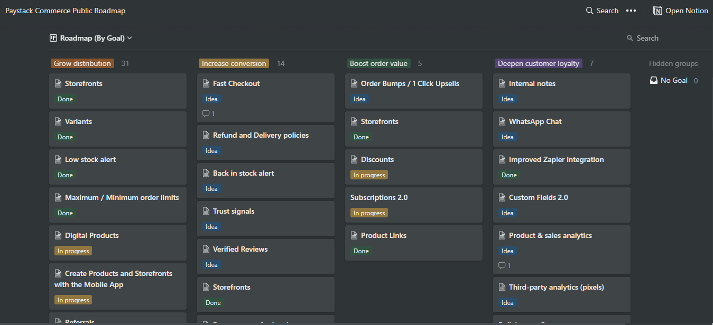
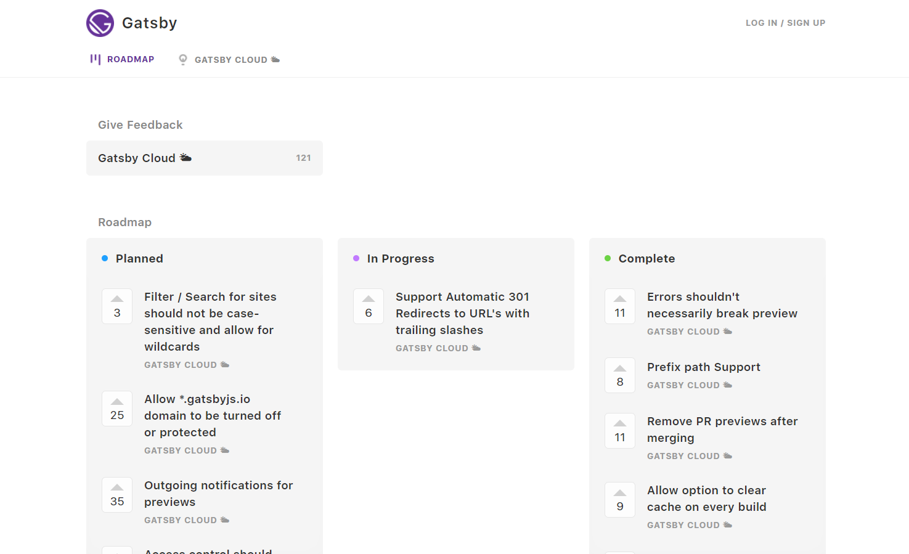
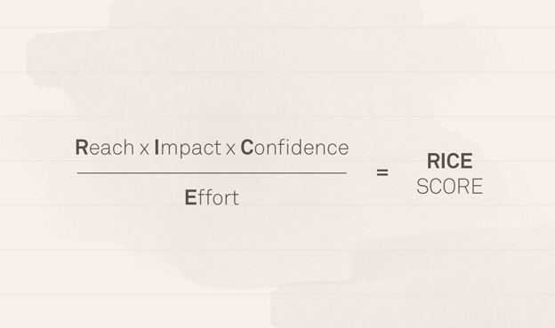
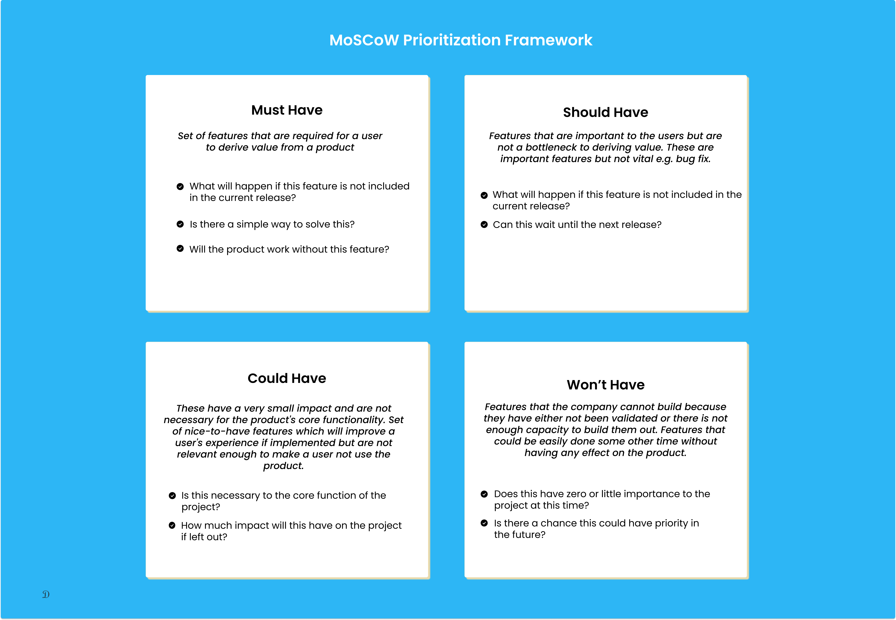

### What is a Product Roadmap

A roadmap is a plan that shows a set of initiatives that an organization plans to embark upon over a certain period. It shows the priorities and focus of a company at different times in a calendar year, quarter, or month. 

However, product roadmaps are often misinterpreted as a list of features but that is not true (or half true). Roadmaps are strategic documents that are iterative in nature - They visualize the product vision and strategy and communicate the why and what behind a product. A good product roadmap must be influenced by the company's goal, and the insights gathered from product discovery. 

Ideally, your product roadmap should be goal-oriented i.e. outcome-based. This means it is in response to validated insights that help product teams to prioritize initiatives that are key to the company's goals as against traditional roadmaps that are subjective to the highest-paid person's opinion (HIPPO) in the company. HIPPO-influenced roadmaps often do not have the interest of the users and are usually a prerequisite to failed products - products that do not meet the need of their users.

### Why you need a Product Roadmap.

As planning is tantamount to embarking on any journey, so is road mapping to building products. Having a roadmap helps you with the following and more:

- It serves as a guide for your product lifecycle. Helps to highlight distractions and drive focus.
- Specific roadmaps like public roadmaps motivate your users and turn them into your product evangelists and advocates.
- A roadmap helps you to drive cross-functional alignment within your team.

### How to create a Product Roadmap.

> You do have a product strategy, right? If not, your product roadmap has no real context, and that's a serious problem - Marty Cagan
> 

In creating your roadmap;

**Start with the Product Vision and Product Strategy**. Creating your roadmap starts from having a [product vision](https://www.damilolaa.xyz/product-documentation-series-product-vision) and a [product strategy](https://www.damilolaa.xyz/product-documentation-series-product-strategy). This means you have created a vision for the product that everyone on the team is aligned with and is steering towards the same direction to see it to fruition. What the roadmap does is that it brings these visions, plans, strategies into initiatives that are now owned and implemented by different teams. The roadmap helps to visualize the product strategy by breaking down the overarching goals into initiatives. 

**Plan, create a goal-driven roadmap, and keep iterating**: Road mapping is a data-driven and collaborative effort of a cross-functional team. For existing products, it is important to be able to find a relationship between the previous roadmap outcome and the new one. If the roadmap goal was not accomplished, the new roadmap should be a continuation of the previous one with a different approach to implementation based on the insights gathered. 

Hitting your roadmap goal - executing all the initiatives within the allocated time is great but it shouldn't be always seen as a success because a roadmap should always iterate based on changes in the industry or in customer behavior and this often alters the goals of that roadmap. So, it is important to always re-define success even at every iteration.

Great roadmaps are built on product discovery insight. Therefore, building a roadmap should be about solving the user's problem and helping them achieve success within your product. The product discovery phase is where you put yourself in your user's shoes to better understand their pain points and how much they need a solution. 

### What makes up a Roadmap?

Most roadmaps are made of Themes, Epics, Stories, and Features. These components sometimes can be interpreted as Initiative, Epic, Story, Task, and Subtask. Either way, use what works for you and your team.

- **Themes** are a high-level picture of your initiative. Mostly talks about the "what" than the "how". This helps you tie your initiatives around goals and not features.

*Example: User experience improvement.*

- **Epics** goes a little deeper into the themes to clarify what is required to execute them.

*Example: Get an NPS/CSAT of 9 by the end of Q1.*

Epics are broad and therefore require more time to complete. Based on the complexity, epics could take from a month to a quarter or more but usually not less than a month. Epics cannot be completed in a sprint but stories can.

- **Stories or user stories are** a way of reporting issues from an end user's perspective. Think of it as telling a story of the pain point your users are experiencing on your platform and how it is a barrier to deriving value.

Stories go deeper into the problem that the user is having, the solution they want, and the goal they wish to achieve with the solution.

A typical user story will follow this pattern: 

***As a [user persona], I want [to perform this action] so that [I can accomplish this goal].***

The essence of writing a user story to communicate your epics is to make it relatable for the engineers and help them see the pain point that the user is experiencing and the goal they wish to get out of the solution. A great user story should include acceptance criteria which is a set of conditions that the solution must satisfy before the user story can be considered as completed.

Here's an example:

**User story:** *As a vegan ordering grocery on Byke, I will like to get a personalized feed of vegan-only produce when I log in to the app so that I can save myself the stress of manually looking through other items that are not of interest.*

**Acceptance Criteria:** *Given that a verified user provides their preferred meal type/choice, they should get a personalized feed based on their interest.*

- **Features** are the solution that emanates from solving your stories. It is what the user sees and interacts with to move beyond the bottleneck that they were experiencing. Features are the end result of a completed user story.

### Some types of Product Roadmap.

- Public Roadmap: This is a very high-level view of what your roadmap really is (It can pass for a laundry list of task). The purpose of creating a public roadmap is to create excitement around intending features that will be added to your product and not necessarily to gain alignment as in the case of an internal one. 

This type of roadmap helps keep your users and investors informed about what you're building and serves as a feedback loop to hear their thoughts on some of the initiatives you have lined up. 

 Some examples of public roadmaps are  [Paystack Commerce Public Roadmap](http://paysatck.com/commerce/roadmap) and [Gatsby Cloud Public Roadmap.](https://portal.gatsbyjs.com/)

<figure>
  
  <figcaption><a href="https://www.notion.so/e71c8bf49edb457fbeaba2cba9143adb"> Paystack Commerce Public Roadmap </a> </figcaption>
</figure>

<figure>
  
  <figcaption><a href="https://portal/gatsbyjs.com"> Gatsby Cloud Public Roadmap </a> </figcaption>
</figure>

- Internal Roadmap: This is for in-house teams and has detailed information about the initiatives a company is undertaking. Internal roadmaps can be further segmented by departments based on the size of the company and the complexity of the product. For instance, in a company, there could be a product roadmap, engineering roadmap, marketing roadmap, quality assurance roadmap amongst other types. However, all these individual roadmaps are influenced and unified by the product roadmap.

### How to prioritize initiatives on a roadmap.

Prioritization is key in road mapping because of its impact on product success. If not carried out well, mistakes that could cost the company a lot can happen. In creating your roadmap, it is also very important that you understand the relevance each initiative has to your overarching goal.

While prioritization frameworks are a great way to prioritize initiatives, you shouldn't limit yourself to them only. Influencing your prioritization approach by your industry, users, or demography will go a long way in helping you create a framework that is unique to your domain. 

In prioritizing initiatives on your roadmap, I find these 3 criteria to be important;

- **Customer value** - What impact does the initiative add to the user?
- **Business value** - What value does it bring to the company. How does this help us achieve our vision?
- **Innovative value** - How does this stand us out among our competitors?

Below is a list of prioritization frameworks that are often used.

**RICE:**

<figure>
  
  <figcaption><a href="https://www.intercom.com/blog/rice-simple-prioritization-for-product-managers/"> RICE Formula </a> </figcaption>
</figure>

Rice is a prioritization framework that was developed by product leaders at [Intercom](https://www.intercom.com/) to help narrow down on the most important set of features for a company. The prioritization is based on these concepts which make up the acronym RICE:

- **Reach:** How many users will this initiative reach?
- **Impact:** How many users will derive value from this?
- **Confidence level:** How convinced are we that this will work?
- **Effort:** How much effort is required to build this out?

**MoSCoW**

This model prioritizes based on the level of importance an initiative is to help a user derive value from a product. It categorizes these levels of importance into the following:

<figure>
  
  <figcaption>Moscow Prioritization Framework</figcaption>
</figure>

[Kano Model](https://www.damilolaa.xyz/delighters-the-wow-feature-set#:~:text=The%20Kano%20model%20outlines%20product%20attributes%20based%20on%20how%20customers%20perceive%20them%20%E2%80%94%20In%20clearer%20terms%2C%20not%20all%20features%20affect%20customer%20satisfaction%20equally.%20He%20uncovered%20users%20attitude%20by%20using%20the%20Kano%20questionnaire%20to%20ask%20two%20pairs%20of%20important%20questions%2C%20to%20narrow%20down%20feature%20decision%3A)

The Kano model outlines product attributes based on how customers perceive them because not all features affect customer satisfaction equally. Similarly to Moscow, This model breaks down features into the following:

- Basic features (Must-Have).
- Neutral features. (Could Have)
- Performance features. (Should Have)
- Delighters (Excitement features)

Leveraging any of these frameworks helps to create a blueprint and standard for prioritizing initiatives in a company by setting benchmarks that suggested initiatives have to pass before getting considered.

### Conclusion

It is important to remember that road mapping is not a once-a-year event but an iterative and collaborative process that is influenced by key findings and learnings you make as you progress with building out your product. Product experts recommend that a roadmap should be reviewed at least once a quarter to realign the team, review work done so far, share learnings, and also manage expectations. 

Happy Road-mapping ✨

### 📚 Additional resources

[Product Roadmap Templates - ProductPlan](https://www.productplan.com/templates/)

[Andrew Chen Product Roadmap Template](https://docs.google.com/spreadsheets/d/1zlx3RuidNOW40Zf7gh07p2SqoR53Ungv9JFT-PhHwxI/edit#gid=455322044)