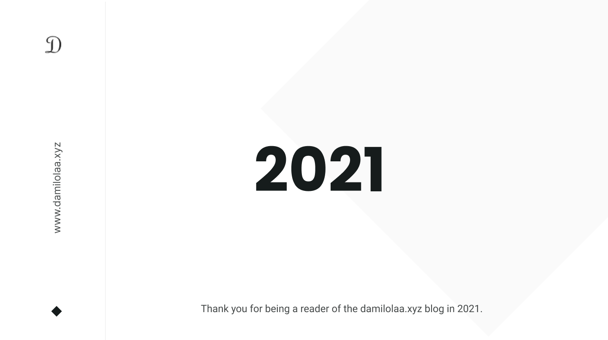
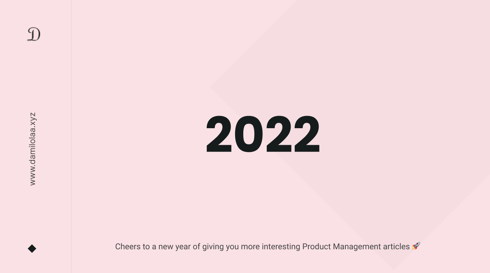

It’s been an eventful and amazing 2021 and this article is a rundown of my most consumed and most informative resources that have been resourceful in my Product Management journey this year. They cover subjects around Product Management, Growth Strategy, Building and Scaling a Startup, Raising Funds, and everything Technology.

<figure>
  
  <figcaption> Thank you for 2021 </figcaption>
</figure>

<!-- <figure class="video_container" style="text-align: center">
 <iframe src="https://coda.io/embed/jspxQJ6XAt/_sut2b?viewMode=embedplay" width="900" height="500"  allow="fullscreen"></iframe><figcaption>A short clip showing some PLG practices in Calendly onboarding process. (Switch to full screen for a better view)</figcaption>
</figure> -->

I have been fortunate to have been able to leverage a bunch of resources that have accelerated my learnings in this outgoing year but some of them really stand out and that is why I am sharing them with you.

In no particular order, below is the list of some of the resources that made 2021 worth the while.

### [HIBT - How I Built This Podcast by NPR.](https://www.npr.org/podcasts/510313/how-i-built-this)

This is arguably the best podcast currently in technology. The How I Built This Podcast hosted by [Guy Raz](http://guyraz.com/) spotlights entrepreneurs’ stories: how they started out, how they failed, how they got themselves back up and built a business empire out of an idea. Guy recently released a book about the show. It’s called [The How I Built This](https://www.amazon.com/gp/product/0358216761?tag=houghtonmif04-20).

Some of my favorite episodes includes

[How I Built This with Guy Raz - Canva: Melanie Perkins (2019)](https://podcasts.google.com/feed/aHR0cHM6Ly9mZWVkcy5ucHIub3JnLzUxMDMxMy9wb2RjYXN0LnhtbA/episode/MTQ4NWRlZTQtNWEzMS00ODk2LWJkZmItMDFjNWM4MWVjY2Q5?sa=X&ved=0CAUQkfYCahcKEwiQ5vOx1on1AhUAAAAAHQAAAAAQNQ)

[How I Built This with Guy Raz - reCAPTCHA and Duolingo: Luis von Ahn](https://podcasts.google.com/feed/aHR0cHM6Ly9mZWVkcy5ucHIub3JnLzUxMDMxMy9wb2RjYXN0LnhtbA/episode/N2Q0ODczYjYtOWMxOC00MjBlLTkwMGMtNjYyZDE1Y2MyZTIw?sa=X&ved=0CAUQkfYCahcKEwiQ5vOx1on1AhUAAAAAHQAAAAAQNQ)

[How I Built This with Guy Raz - Khan Academy: Sal Khan](https://podcasts.google.com/feed/aHR0cHM6Ly9mZWVkcy5ucHIub3JnLzUxMDMxMy9wb2RjYXN0LnhtbA/episode/YTQ1NGIxMDctNzIwNC00ZGEwLWJmM2MtMTk1OTRkMDhmZWEw?sa=X&ved=0CAUQkfYCahcKEwiQ5vOx1on1AhUAAAAAHQAAAAAQNQ)

[How I Built This with Guy Raz - Fitbit: James Park](https://podcasts.google.com/feed/aHR0cHM6Ly9mZWVkcy5ucHIub3JnLzUxMDMxMy9wb2RjYXN0LnhtbA/episode/MWI5M2I1NDEtMmY2ZS00NTc5LTg3OGItZjI2OTVlZjUzZjQ5?sa=X&ved=0CAUQkfYCahcKEwiQ5vOx1on1AhUAAAAAHQAAAAAQNQ)

[How I Built This with Guy Raz - Zappos: Tony Hsieh](https://podcasts.google.com/feed/aHR0cHM6Ly9mZWVkcy5ucHIub3JnLzUxMDMxMy9wb2RjYXN0LnhtbA/episode/MGEyZmRmYTMtMzM4Zi00YjFmLWFlMmUtN2IwYTc3NDE2OGFk?sa=X&ved=0CAUQkfYCahcKEwiQ5vOx1on1AhUAAAAAHQAAAAAQNQ)

[How I Built This with Guy Raz - TOMS: Blake Mycoskie](https://podcasts.google.com/feed/aHR0cHM6Ly9mZWVkcy5ucHIub3JnLzUxMDMxMy9wb2RjYXN0LnhtbA/episode/OGQ4NzQyNDYtM2U3My00MzBkLTkyMGMtNzU4NWFmMjY1M2U5?sa=X&ved=0CAUQkfYCahcKEwiQ5vOx1on1AhUAAAAAHQAAAAAQNQ)

[How I Built This with Guy Raz - DoorDash: Tony Xu](https://podcasts.google.com/feed/aHR0cHM6Ly9mZWVkcy5ucHIub3JnLzUxMDMxMy9wb2RjYXN0LnhtbA/episode/MTc1NzVjMWQtYTFjNy00ZWJiLThmZTctYWE0MDc2NDFlYjg3?sa=X&ved=0CAUQkfYCahcKEwiQ5vOx1on1AhUAAAAAHQAAAAAQNQ)

[How I Built This with Guy Raz - Rent The Runway: Jenn Hyman](https://podcasts.google.com/feed/aHR0cHM6Ly9mZWVkcy5ucHIub3JnLzUxMDMxMy9wb2RjYXN0LnhtbA/episode/MDIyOTlhZjAtNzk0MC00ODM5LWEwZDktOTUzMjYxNDIyOGRj?sa=X&ved=0CAUQkfYCahcKEwiQ5vOx1on1AhUAAAAAHQAAAAAQNQ)

[How I Built This with Guy Raz - Slack & Flickr: Stewart Butterfield](https://podcasts.google.com/feed/aHR0cHM6Ly9mZWVkcy5ucHIub3JnLzUxMDMxMy9wb2RjYXN0LnhtbA/episode/MDg4ODE3NTEtZDQyMS00ZjJjLTg4M2YtNjZhZWQ2ZmJmYjZm?sa=X&ved=0CAUQkfYCahcKEwiQ5vOx1on1AhUAAAAAHQAAAAAQNQ)

[How I Built This with Guy Raz - Instagram: Kevin Systrom & Mike Krieger](https://podcasts.google.com/feed/aHR0cHM6Ly9mZWVkcy5ucHIub3JnLzUxMDMxMy9wb2RjYXN0LnhtbA/episode/NDk5NTNhMmMtOGIyMC00ODE4LWE3NTctZTkwYmIwM2FmMGJl?sa=X&ved=0CAUQkfYCahcKEwiQ5vOx1on1AhUAAAAAHQAAAAAQNQ)

### [Lenny’s Newsletter](https://www.lennysnewsletter.com/)

Lenny newsletter is a weekly newsletter on Product Management, Growth Strategy, Marketing, and others written by [Lenny Rachistky](https://www.lennyrachitsky.com/). Lenny is an angel investor and a former Growth Product Manager at Airbnb. He currently teaches a [product management fundamental course](https://www.lennyrachitsky.com/course). 

Here are a few of my favorite articles from Lenny in 2021:

[Content-driven growth](https://www.lennysnewsletter.com/p/content-driven-growth-strategy)

[The jobs of a product manager](https://www.lennysnewsletter.com/p/jobs-of-product-manager)

[How people discover new products](https://www.lennysnewsletter.com/p/how-people-discover-new-products)

[The 10 commandments of salary negotiation](https://www.lennysnewsletter.com/p/negotiating-comp)

[60 ideas to boost your growth](https://www.lennysnewsletter.com/p/turbo-boosts)

[A founder's guide to community](https://www.lennysnewsletter.com/p/building-community)

### [Shreyas Doshi Twitter Threads](https://twitter.com/shreyas/)

If you’re into Product Management and are not following [Shreyas Doshi](https://twitter.com/shreyas/) on Twitter yet, then you are missing a lot. Shreyas Doshi is a Product Leader with experience leading product teams at Stripe, Google, and Yahoo and recently transitioned into a more consulting and advisory role for various technology startups. 

He tweets around everything Product Management, Leadership, Managing teams, Hiring, and a lot more.

Here is a little of my favorite of his tweets this year.

 

[https://twitter.com/shreyas/status/1409726218438549514?s=19](https://twitter.com/shreyas/status/1409726218438549514?s=19)

[https://twitter.com/shreyas/status/1401598910792011776?s=19](https://twitter.com/shreyas/status/1401598910792011776?s=19)

[https://twitter.com/shreyas/status/1466494880180359168?s=19](https://twitter.com/shreyas/status/1466494880180359168?s=19)

[https://twitter.com/shreyas/status/1460848932116844550?s=19](https://twitter.com/shreyas/status/1460848932116844550?s=19)

[https://twitter.com/shreyas/status/1463383248466178051?s=19](https://twitter.com/shreyas/status/1463383248466178051?s=19)

[https://twitter.com/shreyas/status/1449442095450636288?s=19](https://twitter.com/shreyas/status/1449442095450636288?s=19)

[https://twitter.com/shreyas/status/1443417831509397508?s=19](https://twitter.com/shreyas/status/1443417831509397508?s=19)

[https://twitter.com/shreyas/status/1442600140930359296?s=19](https://twitter.com/shreyas/status/1442600140930359296?s=19)

[https://twitter.com/shreyas/status/1441866360313634823?s=19](https://twitter.com/shreyas/status/1441866360313634823?s=19)

[https://twitter.com/shreyas/status/1440138354390016003?s=19](https://twitter.com/shreyas/status/1440138354390016003?s=19)

### [Top of the Lyne Newsletter](https://www.topofthelyne.co/)

This is a Product-Led Growth newsletter written by [Ruchin Kulkarni](https://www.blog.toplyne.io/author/ruchin/) spotlighting different tech companies’ growth strategies and how they leveraged different Product-Led Growth initiatives to drive adoption, activation, and retention for their products.

Below are a few of the articles that stand out for me:

 

[Netlify: heading the headless revolution](https://www.topofthelyne.co/p/netlify-heading-the-headless-revolution)

[Sourcegraph: Google for code](https://www.topofthelyne.co/p/sourcegraph-google-for-code)

[Algolia: Your search ends here](https://www.topofthelyne.co/p/algolia-your-search-ends-here)

[Notion: the all-in-one productivity tool](https://www.topofthelyne.co/p/notion-the-all-in-one-productivity)

[How Figma built a $10B GTM engine 🎨](https://www.topofthelyne.co/p/how-figma-built-a-10b-gtm-engine)

[How Hopin grew to $7.8 billion in less than two years ⚡️](https://www.topofthelyne.co/p/how-hopin-grew-to-7-8b-in-less-than-two-years)

[How Atlassian built a $50B+ acquisition-led growth engine 🤝](https://www.topofthelyne.co/p/how-atlassian-built-a-50b-acquisition-led-growth-engine)

### [Growth.design](http://growth.design)

This is an interactive comic-designed teardown of the user experience of major software applications. The [growth.design](http://growth.design) team reviews processes based on several user experience factors like usability, accessibility, human psychology, and the likes to share feedback and suggest fixes and improvements for the product.

These are some of my favorite teardowns for the year.

[How Tinder Converts 8% Of Singles Into Customers In Less Than 15min.](https://growth.design/case-studies/tinder-monetization)

[Calm Referral Strategy: Drive Viral Growth With Simple Rewards](https://growth.design/case-studies/calm-growth-referral-tactics)

[Duolingo's User Retention: 8 Tactics Tested On 300 Million Users](https://growth.design/case-studies/duolingo-user-retention)

[The Psychology of Clubhouse's User Retention (...and churn)](https://growth.design/case-studies/clubhouse-user-retention)

[How To Properly Apply Jobs-To-Be-Done To User Onboarding](https://growth.design/case-studies/headspace-user-onboarding)

[The Psychology Behind TikTok's Addictive Feed](https://growth.design/case-studies/tiktok-feed-psychology)

While there are a ton of other resources that have been helpful in propelling me to be a better Product Manager, these ones stand out in their approach to writing or presenting and the thoughtfulness put into making them.

I hope you find these resources as resourceful as I have found them and leveraged them in my day-to-day role as a Product Manager.

<figure>
  
  <figcaption> Cheers to 2022! 🥂 </figcaption>
</figure>

Happy New Year! 🎉🎉🎉