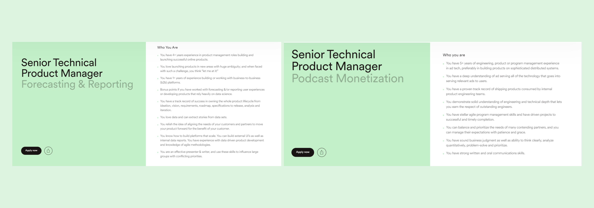
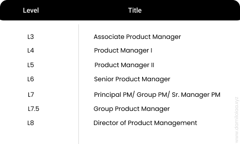
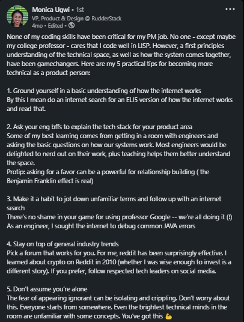

Per Google Trends, search queries for “Technical Product Manager (TPM)” has been on the rise in the past few years. This trend can be attributed to the increased demand for this role due to the advent of new technology innovations like Web3, FinTech, and Data Infrastructure, it could also be attributed to the scalability difficulties that companies face as they enter into new markets and struggle to effectively manage internal technical teams, and most likely the attractive compensation package for the role. 

About 2000+ Technical Product Manager roles in the US with salaries ranging from $64K - $163K were listed on [Glassdoor](https://www.glassdoor.com/Job/united-states-technical-product-manager-jobs-SRCH_IL.0,13_IN1_KO14,39.htm?fromAge=30) between July and August 2022. With this increasing spotlight on TPM role and the few resources available to dissect the role properly, this article is my attempt to shed some light on who a technical product manager is, and how the role is synonymous with and differs from the generalist product manager role and how PMs can make the pivot should they find it interesting.

So, let’s start with the word “technical”.

### ⌨️ **What does being technical really mean as a PM?** 

The first thing to point out is that being technical does not primarily mean the ability to write code or perform other strenuous tasks (like centering a div 😉) that software engineers do. In the real sense, it is more related to domain expertise in one’s product industry.

For example, in a cloud-based or developer tooling company, the technical product manager will have engineering, design, and coding skills. Alternatively, if you have a clothing startup (not e-commerce), you’ll need a technical product manager who has experience in apparel production and fashion. 

Likewise, if you’re a fintech company, your technical product manager will have experience in remittances, payments, lending, etc., and not necessarily a background in software engineering even though the latter makes communication with core stakeholders easier as I point out below. Even at this, the software engineering skills aren’t what makes a 10X fintech technical product manager. It is his in-depth understanding of fintech rails and infrastructure and his ability to balance it with business strategy.

<figure>
  
  <figcaption> Distinctions in two TPM roles requirement in a company. Source:<a href="https://www.lifeatspotify.com/jobs" target="_blank"> Spotify career page </a> </figcaption>
</figure>

The requirements for a TPM within fintech can also vary depending on the kind of fintech product they build and the intended users of the product. A TPM for a B2C lending product would have experience working on/with credit and lending infrastructure and have good knowledge of concepts like credit scoring, risk management, and how lending products are built. While a TPM for an open banking API fintech might not have the skills that the latter TPM possesses but would be expected to have a strong understanding of the tech stacks and APIs and be able to work with them.

*A Technical Product Manager is not primarily an ex-software engineer. Even though today the majority of TPMs come from an engineering background, that trend has continued to change. A TPM is someone with strong knowledge and background of how products in his industry are built and can drill down into the technical intricacies of such products to create informed tradeoffs that bring about user-centric products.*

### 🧑🏿‍💻👩🏿‍💻 **Should a Product Manager know how to code or not?** 

The answer to this question is largely dependent on certain factors like the company, product, and intended users. Some companies require TPMs to code more as part of their role than others while some only require PMs to write technical requirements and have a strong understanding of engineering architecture. 

Coding experience could be required for data PMs that might help write complex SQL or KQL queries to gather insights and analyze data for internal tracking or for creating dashboards for leadership teams. 

This could also be true for companies that have just a more technically complex business, like a developer-oriented SaaS company like Vercel or Gitlab whose product’s primary audience is technical teams.

While a traditional Product Manager *might not* be required to code on the job, it is important that she knows how product ideas translate into usable products (which is largely influenced by design and engineering). A Product Manager should be grounded in the fundamentals of product design and engineering and **should be able to answer basic questions like:

- What server is our product hosted on?
- How does the server work?
- What tech stacks are our products sitting on?
- What is a pull request?
- What does it mean to merge a pull request?
- What kind of deployment process do we use? 

This is only a fraction of the list of technical jargon that a PM needs to know and understand. Since the engineering team is a major stakeholder, it is essential that the PM understands their language and is always able to create alignment with them. This trait shouldn’t be limited to Technical Product Managers only.

Most TPMs are more likely to succeed in their role if they have coding background and experience. Some TPM roles require you to code on the job (10-15% of the JD) while others only deal with managing technical architectures and removing bottlenecks in the technical team's processes.

### 🧑🏻‍🤝‍🧑🏾 **Technical Product Manager vs Technical Program Manager** 

This section requires a whole article to it to avoid over-summarizing the details involved in the differences and similarities between the two roles. So watch out for my next article.

### ⚒️ **What does a Technical Product Manager do?** 

There are a bunch of similarities between the TPM and the generalist PM role.  TPMs are more focused on the technical side of products and are required to have expertise in their product industries. Below are some of the gaps that a TPM would usually fill up in their role:

- Technical Product Managers communicate and translate business needs into technical requirements and vice versa. They serve as a strong bridge between business and engineering.
- They make tradeoffs in product development and are skilled with trade-offs and decision-making analysis like [build v buy analysis](https://www.cmu.edu/tcinc/students/course_documents/08/BuyBuild.pdf).
- TPMs are documentation custodians and are usually in charge of the technical specifications of a product. They can double as technical writers for product documentation and demos in smaller teams.
- They work closely with the development team on product prioritization, product strategy, product lifecycle, and product development, making use of their technical knowledge of the product.
- They leverage their technical background in prioritizing backlog items based on technical effort and budget, developing user stories and business requirements, and improving coordination over cross-functional teams
- TPMs are comfortable with analysis, interpreting dashboards and key call-outs, understanding or setting metrics/financial goals, and working with developers/data scientists seamlessly.
- They break down vague product ideas and customers’ needs like a software architect will do and go about experimenting or iterating to find an appropriate solution.
- In big organizations, Technical Product Managers are laser-focused on their internal customer's needs and scaling internal platforms and services for continued organizational growth.

### 🪜 **Career Projections and Benefits of being a TPM?** 

Technical product managers can be a tremendous asset to a product management team. They bring a different perspective to product management that can be both a reality check on what is feasible as well as unlock new possibilities by leveraging new technological innovations.

They can also be an incredibly helpful bridge to the technical teams that may not always respect the decisions coming out of product management due to their lack of deep technical understanding. Being able to engage with engineering on a level playing field can yield better, faster, and more innovative outcomes for solving business problems and addressing customer needs.

It is no news that being technical comes alongside some very good benefits. This is not to say that a TPM role is generally better than a PM role. However, TPM roles are more challenging than the traditional PM role in that they are regularly interfacing with core technical initiatives that are intense and require technical prowess rather than a traditional PM role.

TPMs in big tech companies get higher pay and benefits than their PM counterparts and a typical career ladder of TPM at Google, Meta, and Amazon will follow the same pattern as their PM counterpart as listed below:

<figure>
  
  <figcaption> PM career ladder </figcaption>
</figure>

### 🤔 Should I Make the Switch from PM to TPM? 

If this question is solely motivated by the juiciness in the compensation, then it might be a bad idea. PM roles are more generalist and in abundance than TPM roles and not all companies will require TPMs because they are often required in growth-stage companies while PMs can fit in any company regardless of the stage they are in.

In making this consideration, ensure that you are very comfortable with technical ambiguity - this is usually the sweet spot of folks with a Computer Science or Software Engineering/DevRel background who are looking to switch into a business-facing role. If this is you, then a TPM role might be a good choice.

While the TPM role is not restricted to the folks defined above, anyone can make the jump. In fact, coming from a non-technical background shows how versatile you are. As stated earlier, if you have a strong background in a space and are looking to get more technical in that space, then a TPM role might be the role for you.

### 🪴 How do I become a TPM? 

- **Pick an area of tech that you are passionate about**

If you’ve chosen a software product, for instance, drill down on what it takes to build software products; what the lifecycle entails, and what each step of the process means from a technical standpoint. 

- **Learn how Products are built in your chosen industry**

Drilldown into the users and their needs, market compliance and regulation, tech stacks, technical vulnerabilities, trade-offs, etc.

- **Put into practice what you have learned.**

If you’re passionate about working on the technical side of a fintech product, for instance, the best way to get started is to practice on a fintech product. Try joining an organization that aligns with your interest (as a PM) and shadow existing TPMs in the company, ask questions, and learn how the process plays out.

- **Stay up-to-date with technology trends.**

Join communities, read articles, review technology stacks, contribute to projects and always stay up-to-date with the dynamics and changes in the space. Below are some handpicked resources that can help you.

Newsletter: [Technically.dev by Justin Cage](https://technically.dev/posts)

Podcast: [Indie Hackers](https://developer.mozilla.org/en-US/docs/Learn/Common_questions), [SyntaxFM](https://syntax.fm/).

Resources & Training: [Freecodecamp.org](http://freecodecamp.org), [Software Architecture 101](https://www.educative.io/courses/web-application-software-architecture-101), [Common questions about the web](https://developer.mozilla.org/en-US/docs/Learn/Common_questions), [Introduction to Computer Science](https://www.edx.org/course/cs50s-introduction-to-computer-science).

### Conclusions

<figure>
  
  <figcaption> <a href="https://www.linkedin.com/in/monicaugwi/"> Source: Monica Ugwi </a> </figcaption>
</figure>

Technical Product Management is an amazing role that is steadily bridging the gap between product management and engineering by ensuring that there is always cross-functional alignment and scalable/performing products that delight users are shipped.

While the goal of a TPM and PM are the same, the roles' distinctions are only related to the specialties that each of the functions takes on. Asides from this, TPM is just another shade of product management.

Thanks to [Njeri Grevious](https://www.linkedin.com/in/njerigrevious) and [Jairo Franco](https://www.linkedin.com/in/jairofranco/) for reviewing this article.

_Found this article insightful? Kindly share with others and please, subscribe to my mailing list to always get product articles like this in your mailbox once a month._

### 📚 Additional resources

[Hero Image Illustration](https://icons8.com/illustrations/author/HzkZD6h9f9qm)

