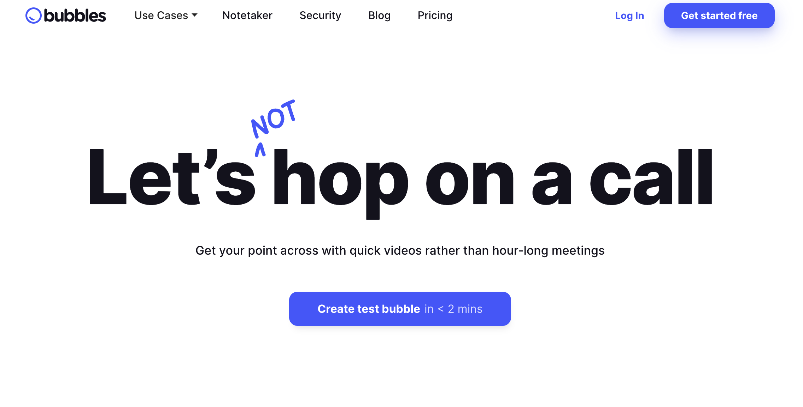
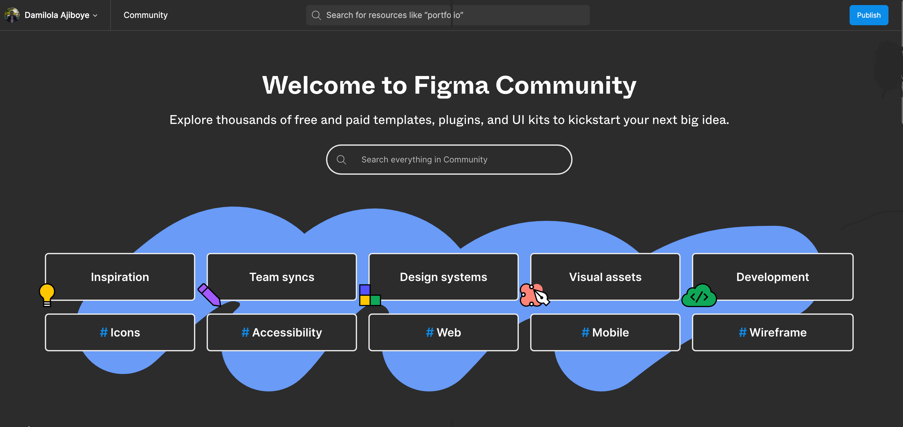

2023 was a very eventful year for me as a product manager. I began the year leading the development of [Stears Elections](https://stears.co/elections), Nigeria’s first real-time elections portal that allowed millions worldwide to follow Africa’s most prominent democratic process. Midway through the year, I led efforts to improve user engagement and retention. By the end of the year, I collaborated with cross-functional stakeholders to define and craft the next iteration of the Stears product.

I’ve grown from a product manager shipping products used by a few hundred users to products used by hundreds of thousands of users globally. I am grateful to have worked with such an amazing team who make striving for success easy. My efficiency this past year is also a testament to the tools that have improved my productivity.

These tools cut across product analytics solutions that make metrics evaluation seamless, collaboration tools that supercharge cross-functional alignments, and productivity tools that automate mundane tasks that would have cost me hours and days.

## Product Analytics Tools

These tools help in validating hypotheses around a solution/feature that has been shipped and also make it easy to spot bottlenecks in the user’s experience. I use these tools to answer questions like:

- How are users using the feature?
- What percentage of users have adopted the feature?
- Are there opportunities to improve the feature?
- Should we continue to invest in or discontinue the feature?

Examples of the tools that provide answers to these questions are:

### Mixpanel

[Mixpanel](https://mixpanel.com/) offers key features for product teams, including event tracking, funnel analysis, retention analysis, user segmentation, A/B testing, and real-time data tracking. These features empower product teams to understand user engagement, optimize user journeys, improve retention, personalize messaging, make data-driven decisions, and quickly address issues or opportunities. 

<figure class="video_container" style="text-align: center">
 <iframe width="400" height="315" src="https://cdn.mxpnl.com/marketing-site/static/video/dashboard-demo-opt-4k.mp4" frameborder="0" allow="accelerometer; autoplay; clipboard-write; encrypted-media; gyroscope; picture-in-picture" allowfullscreen></iframe>
</figure>

They have a [startup program](https://mixpanel.com/startups-apply/) that provides eligible startups with up to $50,000 Mixpanel credit for a year.

### Microsoft Clarity

[Microsoft Clarity](https://clarity.microsoft.com/) offers session recording, heatmaps, and insights. These features help product teams understand user behaviour, identify areas for improvement, and make data-driven decisions to enhance their products. The unique advantage of Microsoft Clarity is that it works with mobile apps and is free to use, making it a cost-effective alternative to Hotjar for gaining valuable user behaviour insights. 

<figure class="video_container" style="text-align: center">
 <iframe width="400" height="315" src="https://www.youtube.com/embed/KvhA1_66PSs?si=1JeufhY7Kr7Ud4jq" title="YouTube video player" frameborder="0" allow="accelerometer; autoplay; clipboard-write; encrypted-media; gyroscope; picture-in-picture; web-share" allowfullscreen></iframe>
</figure>

### Hotjar

[Hotjar](https://www.hotjar.com/) also offers features like heatmaps, session recording, conversion funnels, and feedback polls/surveys. While I would use Microsoft Clarity for session recordings and heatmaps, Hotjar is effective in creating feedback polls and surveys for in-product feedback loops. 

<figure class="video_container" style="text-align: center">
 <iframe width="400" height="315" src="https://videos.ctfassets.net/lh3zuq09vnm2/ZWojt8hbFAN8KkGTWkUC7/f561ae32de811a602c12e3c331b90997/2311_Autogenerate_your_survey_with_AI_v2.mp4" frameborder="0" allow="accelerometer; autoplay; clipboard-write; encrypted-media; gyroscope; picture-in-picture" allowfullscreen></iframe>
</figure>

## Productivity tools

These tools cover process workflow creation, screen recording, and note-taking. These are often the mundane tasks that a product manager would often be involved in throughout the lifecycle of a product.

### Tango

[Tango](https://tango.us/) is a versatile productivity tool for teams to create how-to guides and screen recordings. Tango helps to educate teams on process flows, especially new joiners. I recently used Tango to create a how-to guide for a new internal tool that the team uses, and this has improved knowledge sharing across the teams significantly and reduced fragmented knowledge banks.

Tango *automagically* creates how-to guides for you as you are using the product you would like to walk through, making the process less effort-intensive. They also have an AI-autogenerated list of FAQs that makes it easy for users to get their popular questions answered after watching the walkthrough.

<figure class="video_container" style="text-align: center">
 <iframe width="400" height="315" src="https://www.youtube.com/embed/0qWjjP9rgkQ?si=V-Uwv-SzVVNpa5P8" title="YouTube video player" frameborder="0" allow="accelerometer; autoplay; clipboard-write; encrypted-media; gyroscope; picture-in-picture; web-share" allowfullscreen></iframe>
</figure>

### Bubbles

[Bubbles](https://www.usebubbles.com) is an asynchronous video collaboration tool that offers key features like visual process mapping, screen recording, and note-taking. I use it primarily for screen recording, which often comes in handy during product reviews and quality assurance testing of new features or enhancements. 

Bubbles make it seamless to share constructive feedback with the development team on their implementations, thereby reducing the urge to have multiple *quick huddles* for alignment. 

<figure>
  
</figure>

## Generative AI tools

Driving alignment is one of a product manager’s core attributes, and oftentimes, the key lever to drive an alignment is a document. Supercharging the creation and structuring of these documents can be a lifesaver for a product manager in saving the amount of time they spend writing documents.

### Grammarly AI

[Grammarly AI](https://www.grammarly.com/ai) helps me to improve my writing by checking the grammar, spelling, punctuation, and style. I also like the fact that it works across multiple text editors like Google Docs, Notion, Click Up, Confluence, etc.

<figure class="video_container" style="text-align: center">
 <iframe width="400" height="315" src="https://www.youtube.com/embed/doTMUdBBq7A?si=xq6HZbtv_fNwT6yV" title="YouTube video player" frameborder="0" allow="accelerometer; autoplay; clipboard-write; encrypted-media; gyroscope; picture-in-picture; web-share" allowfullscreen></iframe>
</figure>

### Krisp AI

[Krisp AI](https://krisp.ai/) is a noise-cancelling tool that has been helpful in having clear and private audio calls that are void of background noise. This helps to have meetings while in very busy and noisy areas and still be able to focus on work, especially as a remote worker.

<figure class="video_container" style="text-align: center">
<iframe width="400" height="315" src="https://www.youtube.com/embed/2aDAUMQGK6Q?si=WbrItdoHmJtYINI_" title="YouTube video player" frameborder="0" allow="accelerometer; autoplay; clipboard-write; encrypted-media; gyroscope; picture-in-picture; web-share" allowfullscreen></iframe>
</figure>

## Product Management Tools

This includes design tools, presentation tools, road mapping and project management tools.

### Figjam & Figma Community

[Figjam](https://www.figma.com/figjam/) is an online collaborative whiteboard that has helped me communicate rough sketches of my vision for different features to design stakeholders and get their feedback and alignment. It also helps me in bringing product, design, and engineering stakeholders together to brainstorm the end-to-end lifecycle of a feature in a couple of minutes.

<figure class="video_container" style="text-align: center">
 <iframe width="400" height="315" src="https://player.vimeo.com/video/795742013" frameborder="0" allow="accelerometer; autoplay; clipboard-write; encrypted-media; gyroscope; picture-in-picture" allowfullscreen></iframe>
</figure>

[Figma Community](https://www.figma.com/community) has been my main source of inspiration for new wireframes or designs. While a product manager is not tasked with product design, he needs to be able to communicate his ideas and vision visually, and Figma Community has bridged that learning gap by providing multiple open-source templates that amateur designers like myself can jumpstart with.

<figure>
  
</figure>

### Google Slides

Presentation is a core part of communication that a product manager would be involved in. From sharing opportunities for improvements in the product to communicating insights from user research and presenting findings from product metrics evaluation. A product manager will often be found creating PowerPoint presentations to communicate and buttress their points to stakeholders, and [Google Slides](https://slides.google.com/) has made this very easy for me. Google Slides also has a connection with Google Sheets, making it easy to connect and use charts in Google Sheets in my presentations.

### Click Up

Two years ago, I would have disagreed that I could ever advocate for a Jira competitor, but I guess you can’t fault a product that solves its user’s pain points. [Click Up](https://clickup.com/) has been very effective in handling the project management collaboration between our product, design, and engineering teams. I really enjoy creating EPICS on Click Up for our product initiatives because of their rich-text editor that arms users with various editing features that can make it possible to have in-depth and contextual documentation.

<figure class="video_container" style="text-align: center">
 <iframe width="400" height="315" src="https://www.youtube.com/embed/vUlC187qYhk?si=oTHM63YU5Hw_9jJw" title="YouTube video player" frameborder="0" allow="accelerometer; autoplay; clipboard-write; encrypted-media; gyroscope; picture-in-picture; web-share" allowfullscreen></iframe>
</figure>

## Bonus

### Veed.io

Product managers are involved in all stages of the product lifecycle, including product launch, where they support Marketing teams to refine the best messaging that resonates with the user’s needs. [Veed.io](http://veed.io/) is a tool that simplifies this process by simplifying the video creation and editing process through captioning and subtitling capabilities. Veed.io also provides a number of AI features that allow users to create videos based on certain prompts.

<figure class="video_container" style="text-align: center">
 <iframe width="400" height="315" src="https://cdn-site-assets.veed.io/VEED_Online_Video_Editor_1b15b15318/VEED_Online_Video_Editor_1b15b15318.mp4" frameborder="0" allow="accelerometer; autoplay; clipboard-write; encrypted-media; gyroscope; picture-in-picture" allowfullscreen></iframe>
</figure>

### Lightshot

This is probably my most used tool this year. [Lightshot](https://app.prntscr.com/) is a browser extension that helps users easily take screenshots of webpages, annotate them, and share them as PDFs or images. Like Bubbles, Lightshot makes it seamless to communicate bugs and opportunities for improvements to the team.

<figure>
  
</figure>

As a product manager, it's easy to get bogged down in the day-to-day tasks that come with the job and this can prevent you from fulfilling the core responsibilities of understanding user’s pain points and guiding the company to make the right product decisions. By automating or minimizing these mundane activities, PMs can free up more time to focus on what matters most.

These tools have been essential to my growth as a product manager over the past year and I hope you find them helpful too.