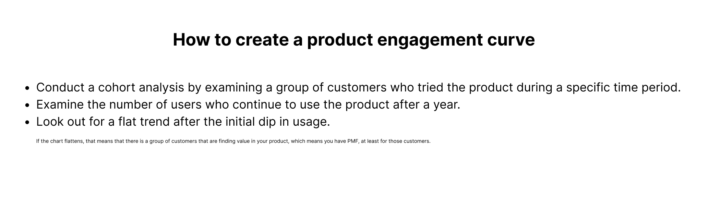

> “You can always feel product/market fit when it **is** happening. The customers are buying the product just as fast as you can make it — or usage is growing just as fast as you can add more servers. Money from customers is piling up in your company checking account. You're hiring sales and customer support staff as fast as you can. Reporters are calling because they've heard about your hot new thing and they want to talk to you about it. You start getting entrepreneur of the year awards from Harvard Business School. Investment bankers are staking out your house.”*
> 

*Also,*

> *“You can always feel when product/market fit is **not** happening. The customers aren't quite getting value out of the product, word of mouth isn't spreading, usage isn't growing that fast, press reviews are kind of ‘blah,’ the sales cycle takes too long, and lots of deals never close. 

                                                                                                                             **Marc Andreessen***
> 

## What is Product/Market Fit

Product/market fit (PMF) is when a product solves its user’s pain points, and there is an increasing demand for it. PMF is a momentum change from “push” to “pull”—a change from fighting for each customer, one at a time, to a sea of signups. Customers love the product; they're telling everyone about it, and they keep coming back for more. 

PMF is a happy match between what your product offers and what people need.

## Why You Should Care About PMF

### **PMF proves and disproves a startup’s product hypotheses**

In my [product discovery article](https://www.damilolaa.xyz/how-important-is-product-discovery), I stressed the importance of forming hypotheses based on your product discovery efforts. These hypotheses help founders focus on the problem(s) they are trying to solve. However, it can be difficult to determine the accuracy of this hypothesis without an indicator like PMF. If the assumptions are correct, it will be evident in your product’s ability to satisfy the market's needs and demands, resulting in loyal customers who are willing to pay for and recommend the product to others. 

For instance, Dell initially focused on building hard drive kits, which seemed like a [successful business](https://www.businessinsider.com/michael-dell-pivot-reinvention-interview-cloud-multicloud-2019-11?r=US&IR=T#:~:text=%22The%20first%20nine%20months%20our%20sales%20were%20%246%20million%20and%20the%20next%20year%20it%20was%20%2433%20million). However, a pivotal moment occurred when a customer visited their office and noticed a PC they had assembled. The customer's simple question, "Why not make computers?" challenged Dell's initial product hypothesis and sparked a realization that there was a strong demand for computers, leading Dell to shift its focus to PC manufacturing. This shift proved to be incredibly successful, as Dell quickly became a major player in the PC industry, demonstrating how the alignment of their product with market demand validated the decision to pivot away from their original business model.

### **PMF informs you how to iterate your product**

The advantage of disproving product hypotheses is that it allows you to identify where you went wrong on the first attempt. This may be due to a misunderstanding of the user’s problem, creating a solution for the wrong market, or building a [delighter](https://www.damilolaa.xyz/delighters-the-wow-feature-set) rather than a painkiller.

For instance, In early 2010, Kevin Systrom launched Burbn, a location-based game that enabled users to check in their location, make travel plans, and share photos. Months later, Kevin and his co-founder, Mike Krieger, analyzed Burbn's user data and discovered that the image-sharing feature was what users used the most. They later decided to take the risk of removing almost all other features and anchor their entire product on the image-sharing feature, which later grew into Instagram. 

This is an example of wrongly prioritizing the problem to solve. While the check-in and travel plan ideas could have seemed viable, there were other competitors that did a better job at solving them than Burbn. 

### **PMF is Investor's best friend and, therefore, should be a founder’s obsession**

According to [Venionaire Capital](https://www.venionaire.com/market-pulse-1-the-significance-of-achieving-product-market-fit/), PMF is a validation that a startup has a clear understanding of its target audience and its pain points, signifies that the startup has identified a scalable business model, and suggests that they have reduced the risk of failure or market rejection. 

One of my favorite shows is [Shark Tank](https://abc.com/shows/shark-tank), and one of the most thrilling aspects of the show is how the Sharks (*successful business leaders*) quiz founders for insights on product-market fit, asking questions like *"Where is your market?"* *"How big is the market?"* *"What are your sales?"* *"Walk us through the sales progression in the past x years?"* and *"What is your customer acquisition cost?”*

Every startup investor looks out for some assurance that their investment will yield returns, especially for post-seed startups (*series A and above*), and the best way to convince an investor is by demonstrating that there is already a demand for the product and that users are willing to pay for it. When the demand is not evident, investors ask founders to spend more time validating their market by acquiring users who are willing to pay for the product before they make any investment commitment.

## How to attain PMF

Attaining PMF is a complex process, and it differs from company to company. Some achieve it within months, while others may take years. 

For instance, it took Netflix 18 months to attain PMF, while Amplitude took 4 years. However, the fact that it took you a longer time to attain PMF does not necessarily mean that your product is not good enough. It means that the market was not ready for your product, and the time it took you to attain PMF is how long it took the market to get ready for the product. 

When a product is early into the market, there isn’t sufficient need for it yet to make users want to pay for it. As a result, companies get turned down by investors when their products are ahead of their time.

[https://images.app.goo.gl/Tf5eroZVaLdDm3eS6](https://images.app.goo.gl/Tf5eroZVaLdDm3eS6)

**Here are some basic gems to bote in positioning your company for PMF**

### **1. Understand your market**

Market analysis lately has become an afterthought for most companies. Most technical founders prioritize the product first and then think of the market much later when they are ready to launch. 

This approach is highly susceptible to failure because it is important to understand the market that you are building for - evaluate the need, competition, and other factors that could inform you if the market is mature enough for your product. 

Frameworks like SWOT analysis can be helpful in evaluating market readiness.

### **2. Understand your prospective customers**

From your understanding of the market, it is important that you clearly identify who your users are in this market. Your users are those who HAVE the need for your product, not those who COULD use it. The latter might become users in the future, but they are not early adopters.

It is also important to accurately describe your user or the ideal customer profile and avoid generalization. For a B2B product, it is important to understand the different people that are involved in the purchase journey, from the end user to the champion and the ultimate decision maker. These three roles have different interests and characteristics and also have varying contributions to the purchase journey.

The aim of understanding your users is to know what pain points they have and if they need your solution. 

Some key insights to unlock in this process include:

- “How much of a problem is this to them?”
- “How are they currently solving this problem?”
- “Is this solution sufficient for them?”
- “Is this problem ephemeral or a huge part of their life”?

Answering these questions will give you a better sense of how your product will fit in your target users’ lives. If it only fills an ephemeral part of their lives, then your product may not achieve PMF or lose it afterward because there won’t be stickiness in your product interactions with its users.

### **3. Build Painkillers, Not Vitamins**

Vitamins are a nice-to-have; you take them sporadically when you’re reminded about your nutritional habits. But painkillers are a must-have such that you would go any length to have them.

In the early days of PayPal, despite competition with eBay’s Billpoint, the company was confident in the business viability because the product was a major painkiller for most eBay merchants who have suffered from many unreliable means of collecting payments in the past and wouldn’t give up a cure to their pains because of a glamorous alternative, Billpoint.

This is the holy grail of PMF - when you know that your product is engraved in your users’ lives so much that it is difficult for them to imagine a day or week (*maybe month in some cases*) without using your product. Products that attain this feat are painkillers and not vitamins - vitamins can easily be rivaled and thrown out by competitors, but painkillers are distinct in their capability to solve the problem uniquely, making it difficult for competitors to sweep them out of business. 

## How to recognize Product/Market Fit when it starts happening.

> *You know you have PMF when your customers become raving advocates for you.*
> 

***Andy Rachleff, Professor of PMF at Stanford.***

In this article, I explored two ways of measuring PMF. Firstly, through a product engagement curve and through qualitative user feedback. 

### **1. Evaluating PMF using the product engagement curve**

A product engagement curve is a useful tool that helps to evaluate how users engage with a product over a specific period. This tool gives an overview of user behavior and highlights the decline in their engagement over time. By analyzing this curve, you can identify power users who consistently maintain high levels of engagement and determine whether you have achieved product-market fit or not.

When implementing this approach, it's essential to determine the product’s [success metric](https://www.damilolaa.xyz/metrics-that-matter). For example, a grocery shopping startup could consider the *number of users who make at least one purchase every month* as its success metric/Northstar. 

Once you've identified your success metric, you should monitor the number of users who meet this criterion over a 12-month period. If you observe a stable trend during this period, it implies that a particular group of users are finding your product valuable.

<figure>
  
</figure>

### **2. Evaluating PMF from qualitative user feedback**

Sean Elis’s leading [indicator](https://www.startup-marketing.com/the-startup-pyramid/) of measuring PMF is a response to the survey question, **“How would you feel if you could no longer use the product?”.** The number of users who respond **“very disappointed”** to this question ****is an indicator of the power users. ****

After benchmarking nearly a hundred startups with his [customer development survey](https://pmfsurvey.com/), Ellis found that the magic number to aim for was **40%** of the total respondents. Companies that struggled to find growth almost always had less than **40%** of users respond “very disappointed,” whereas companies with strong traction almost always exceeded that threshold. 

This approach is well-suited for a B2B startup whose product usage differs from one user to another. For example, some enterprise users of Zoom may only use it once a month, while others may use it every day. However, this does not imply that the former is not deriving value from the product. Fixating only on the users with the most frequent usage can blur a startup’s understanding of its power users, thereby making the product engagement curve approach less representative of the actual value that users are deriving from the product.

Another advantage of anchoring PMF around this survey question is that it helps teams to segment users into cohorts of:

- **Power users -** Raving advocates of the product who will be very disappointed if they lose access to the product.
- **Indifferent users** - Users who are indifferent if they lose access to your product.
- **Passive users** - Users who will not be disappointed if they lose access to your product.

## What to do when there is no PMF

Startups often go through many iterations before they find product/market fit, if they ever do. When there is no PMF, a startup can either shut down its operation or pivot. While the former is not an easy task, some successful companies like Slack, Twitter, Instagram, YouTube, and Moniepoint are all examples of iterations.

While the most [common reasons](https://www.cbinsights.com/research/report/startup-failure-reasons-top/) why startups fail are the inability to raise capital, lack of market need, and fierce competition, 14% of startup failures are due to a lack of founder/problem fit. When there is a founder/problem fit, pivoting the business would only elongate the startup’s stagnation. 

## Conclusion

> “Product/market fit isn’t a one-time, discrete point in time that announces itself with trumpet fanfares. Competitors arrive, markets segment and evolve, and stuff happens—all of which often make it hard to know you’re headed in the right direction before jamming down on the accelerator.” — [Ben Horowitz](https://blog.pmarca.com/2010/03/20/the-revenge-of-the-fat-guy/)
> 

While the majority of this article is on how to attain product/market fit. It is important to note that the job is not done when that has been achieved because PMF can be lost. It is surprising to see that some of the tech giants that once dominated the industries, like Yahoo, MySpace, and Netscape, have lost their prominence in the industry. One of the primary reasons for this is due to the ever-changing nature of user behavior and needs. As users' preferences and expectations continue to evolve, companies that fail to adapt quickly are inevitably replaced by those who can better meet the demands of the market.

With colossal competition across every sphere of technology today, users have more options than ever before and are more likely to switch sides easily. This makes it easy for companies to lose product/market fit.

> *Instead of thinking about product/market fit as a definitive point on the startup path, I think about it as a series of tests and checkpoints that increase in difficulty but also in definitiveness. - Brian Balfour*
> 

---

Thanks to [Joe Kinvi](https://www.linkedin.com/in/joekinvi) and [Joseph Benson-Aruna](https://www.linkedin.com/in/josephbensonaruna) for reviewing this article.