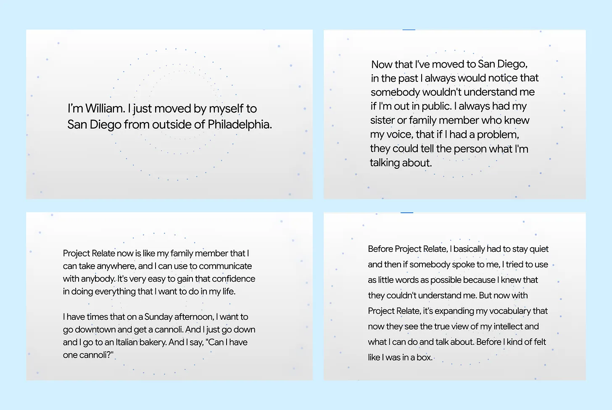
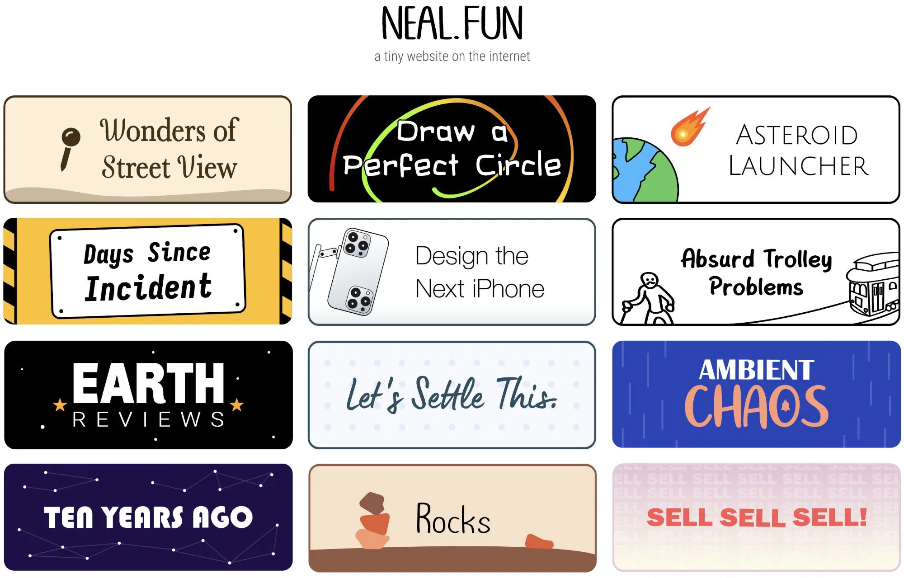

2024 has been nothing short of an amazing year filled with different remarkable experiences. As usual *(see my [2021](https://damilolaa.medium.com/my-2021-end-of-year-lists-265c6066fcf1) and [2023](https://damilolaa.medium.com/10-productivity-tools-that-made-me-a-10x-product-manager-in-2023-bec39cc9aa0f) wrap)*, I thought to share some of the outstanding resources that I’ve found helpful throughout the year. This time, I am sharing different kinds of resources from podcast episodes to articles, tech for social good initiatives, and productivity tools. I hope you find them helpful.

---

## Podcast

In this segment, I shared some of the top podcast episodes that I’ve enjoyed listening to this year. Some of them were recorded years ago but I’ve found the lessons very applicable and relevant.

### 1. [Howard Schultz on How He Built Starbucks](https://open.spotify.com/episode/3T0atk9VPcwZ9ht1AygEYc?go=1&sp_cid=2db6f21d686193eac8ec1677ef17b0a6&utm_source=embed_player_p&utm_medium=desktop)

From growing up in Brooklyn's housing projects to transforming a small Seattle coffee company into the world's third-largest restaurant chain, Howard Schultz's journey of turning Starbucks into a household name is truly inspiring.

His persistence to pivot Starbucks from a company that only sells coffee beans to one that sells different varieties of coffee, to raising funds to buy Starbucks when the founders wanted to sell, to pursuing global expansion to Tokyo only because there was a direct flight from Seattle to Tokyo, Howard’s approach to building and scaling a juggernaut is interesting.

Another key lesson from this Podcast episode is how Howard Schultz was a typical example of a [founder-mode](https://paulgraham.com/foundermode.html) founder. As Starbucks grew and expanded, there was a lot of brand commoditization and they started compromising on the same customer experience culture that was the essence of the company. The company was growing at a rapid rate such that growth was starting to cover up a lot of mistakes like cannibalization between stores and relaxed budgetary and financial discipline.

> I began to enter the store and not recognize what we had built. Howard Schultz
> 

Upon returning as CEO, Howard closed 900 stores—90% of which had opened within the previous year—and began closing all locations at noon for training. This bold move cost Starbucks $24M in lost sales. He insisted on the training because he felt the company had lost its ability to "make quality coffee." He also gathered 10,000 store managers in a stadium where he transparently shared details about the company's health and reinforced the importance of ownership and exceptional customer experience.

About a year later, the company started regaining its culture and maintained an upward trajectory. This experience proved that business success isn't an entitlement—it must be earned. Starbucks had stopped earning it due to their sloppiness, but Howard's decisive approach to refocusing the team proved invaluable. This is the hallmark of the lessons l learned from this episode.

You can listen to the episode by clicking the link below 👇🏾

<figure class="video_container" style="text-align: center">
 <iframe width="400" height="315" src="https://open.spotify.com/episode/3T0atk9VPcwZ9ht1AygEYc?go=1&sp_cid=2db6f21d686193eac8ec1677ef17b0a6&utm_source=embed_player_p&utm_medium=desktop&nd=1&dlsi=d7a730af79b34af5" title="YouTube video player" frameborder="0" allow="accelerometer; autoplay; clipboard-write; encrypted-media; gyroscope; picture-in-picture; web-share" allowfullscreen></iframe>
</figure>

### **2. [Deb Liu on Why You Should PM Your Career Like You PM Your Product](https://youtu.be/MajB5CQUKDA)**

Deb Liu is an exceptional product leader and I always look forward to her LinkedIn post. With a stellar career that includes building a billion-dollar product at Facebook, her journey is packed with practical lessons for aspiring product leaders.

In this episode, Deb shares insights on creating visibility for your work, managing your career like a product, navigating the challenges of a new PM role, and her experience building Facebook Marketplace.

Here are a few key takeaways from the episode:

1. Treat your career like a product roadmap: define long-term goals, break them into actionable milestones, and set clear metrics for success.
    - Identify key skills to develop, roles to target, and regularly adjust your plan based on progress and industry changes.
    - Balance learning and impact by alternating between roles where you’re an expert and those that help you acquire new skills—continuous learners consistently outpace current experts.
2. If self-promotion feels uncomfortable, reframe it as advocating for your team’s needs or highlighting collective achievements. Shifting the focus from “This is about me” to “This benefits everyone” makes the value of self-promotion clearer and more approachable.
3. Introverts must learn to speak up, as the business world often rewards extraversion. Sharing your opinions and highlighting your achievements is crucial for career growth. Leaders must foster an inclusive environment where everyone, not just the outspoken, feels encouraged to contribute.
4. Create a 30-60-90-Day Plan for Starting a New Role:
    - 30 Days (Listening and Learning**):** Meet with a sizeable number of team members and stakeholders to understand their perspectives, challenges, and aspirations.
    - 60 Days (Aligning and Planning)**:** Identify 1–2 areas for immediate impact based on your learnings. Develop and share a plan to address these priorities.
    - 90 Days (Execution and Impact)**:** Implement agreed-upon plans, focus on delivering quick wins, and review your progress and feedback to solidify credibility.
5. On building Facebook Marketplace:
    1. Failing fast is crucial in startups. Empowering teams to operate autonomously and avoiding excessive scrutiny fosters quick iteration and innovation.
    2. Building 0→1 products helps to build critical skills like securing stakeholder buy-in, problem-solving with limited resources, and driving impactful initiatives. These big swings can change a company’s trajectory and are key experiences senior PMs and product leaders should have on their resumes.
    
    You can take a listen 👇🏾
 

### 3. [Becoming a Super Individual Contributor](https://youtu.be/wFhurV1l6Jk)

The debate between the IC (Individual Contributor) and Manager paths in product management has been a hot topic in many product management circles. This conversation is germane especially because of the landscape of the industry today. With recent downsizing and layoff exercises, many companies expect PM Managers to be hands-on and contribute to some day-to-day activities that a Sr. PM or a Group PM would typically be engaged in.

In this Lenny’s Podcast episode, Tal Raviv, Riverside Product Lead shares his 12-year career experience working as an IC PM. Below are some lessons I picked from the conversation:

1. **Support “Super IC” Career Paths:**
    - Define clear senior IC levels (e.g., Principal PM).
    - Develop rubrics for IC progression.
    - Ensure competitive compensation with management roles.
    - Recognize and value experienced ICs’ unique contributions.
2. **Build Self-Reliant Teams:**
    - Promote public communication over private channels.
    - Empower team members to access data and make independent decisions.
    - Reinforce behaviors that reduce reliance on the PM.
    - Foster a culture where product thinking is a shared responsibility.
3. **Balance Book Smarts with Street Smarts:**
    - Combine data-driven decisions with empathy for the customer’s perspective.
    - Consider emotional and perceptual impacts before major changes.
    - Test smaller changes to gauge user reactions before full rollouts.

However, the Manager path is just as important and relevant as the IC path. Like Shreyas Doshi [posits](https://x.com/shreyas/status/1623807602353389568?t=um5lcdNMzUB9H6a8NtdwXA&s=03), The manager path isn’t the “evil path”. The IC path isn’t the “loser’s path”.

You can’t make an informed decision about which path to pursue without experiencing both. It’s best to try out senior IC and Manager roles to determine which aligns better with your strengths, preferences, and long-term career ambitions.

 

### 4. [Prof. John Mearsheimer and Prof. Jeffrey Sachs on the All-In Podcast](https://www.youtube.com/watch?v=uvFtyDy_Bt0)

The past year has been marked by unprecedented geopolitical tensions, perhaps the highest I've seen in my adult life. From the war in Ukraine to Gaza and the South China Sea, these global issues have dominated headlines. In fact, I’d estimate that around 60% of my YouTube sessions this year were spent watching analyses of these conflicts.

[John Mearsheimer](https://en.wikipedia.org/wiki/John_Mearsheimer) and [Jeffrey Sachs](https://en.wikipedia.org/wiki/Jeffrey_Sachs) are both political scientists at the University of Chicago and Columbia University respectively. Below are a few learnings from the conversation:

1. Mearsheimer and Sachs argue that both major political parties (Republicans and Democrats) exhibit little difference in their foreign policy approaches. They both have a shared commitment to maximizing U.S. global power and influence.
2. Both scholars emphasize that U.S. foreign policy has historically aimed to enhance its global influence, often at the expense of other nations' sovereignty. This pursuit is driven by a belief in American exceptionalism and a responsibility to promote liberal democracy worldwide.
3. Mearsheimer warns against the assumption that liberal democracy can be imposed globally through military means, citing historical failures in Iraq and Afghanistan as evidence that such strategies often backfire and undermine domestic liberal values
4. The conversation acknowledges the emergence of a multi-polar world where other nations also seek power, complicating U.S. foreign policy objectives. Sachs suggests that cooperation among democratic nations may be necessary to counteract authoritarian aggression without resorting to military intervention.

You can take a listen 👇🏾

---

# Articles

This section highlights two of the top articles I came across this year. Lately, I've found myself listening to more podcasts than reading articles, as podcasts offer the convenience of multitasking.

### 1. [Founder Mode by Paul Graham](https://paulgraham.com/foundermode.html)

Do you remember back in September when everyone started updating their LinkedIn profiles to "Founder Mode"? At first, I thought it was just another fleeting tech trend until I saw a few connections posting about Paul Graham's article, which had the entire tech industry buzzing for days.

Paul Graham’s argument centers on the idea that as companies grow, founders are often pressured by the board and others to bring in a professional manager, or at least someone to provide "adult supervision." However, he argues that this doesn't have to be the case. Instead, founders should develop a strong product sense, allowing them to make the right decisions to help the company scale. He contrasts “founder mode” with “manager mode.” In founder mode, founders stay deeply involved in every area of the company, much like Steve Jobs, who was obsessively involved in product, design, engineering, distribution, and all the elements that made Apple what it is today. In manager mode, founders step back and delegate much of the strategy execution to their team.

While "founder mode" sounds intriguing, some people have mistakenly equated it with micromanagement. The key difference lies in trust: micromanagement stems from a lack of trust, where the founder doesn't trust their employees to make decisions, take ownership, or solve problems independently. A micromanager gets involved at the task level, directing resources and managing milestones personally. This is not what founder mode is about. Marty Cagan elaborates on this [here](https://www.svpg.com/coaching-founder-mode/).

Another misconception about founder mode is the belief that a founder’s experience and strong product sense alone can carry the company through the growth stage. As Paul Graham points out using Steve Jobs as an example, “Steve Jobs used to run an annual retreat for what he considered the 100 most important people at Apple, and these were not the 100 people highest on the org chart.” This highlights the importance of surrounding oneself with talented individuals who can help achieve company goals without the need for micromanagement. Melissa Perri [further explains](https://productinstitute.kit.com/posts/my-thoughts-on-founder-mode-and-why-it-s-dangerous) that founders in founder mode need exceptional product leaders around them to be successful.

### 2. [Managing Your Manager by Julie Zhuo](https://medium.com/@joulee/the-looking-glass-managing-your-manager-f88fa6505bbe)

Julie Zhuo’s *The Looking Glass* newsletter has long been a valuable resource for practical, experience-based insights on leadership and people management. In this piece, she emphasizes that employees should actively manage their relationships with their managers, rather than passively accepting subpar leadership.

Below are some lessons from the article:

1. Employees should see themselves as the main characters in their career journey. Relying on the belief that your manager is your savior or advocate is wrong.
2. She provides a seven-step approach for enhancing employee-manager relationships:
    - **Understand what a great relationship looks like**: Identify the qualities of a strong manager-employee relationship.
    - **Do your research**: Consult peers and reflect on desired qualities in a manager.
    - **Communicate your vision**: Discuss your aspirations for the relationship with your manager.
    - **Specify your needs**: Clearly articulate the support you need from your manager.
    - **Provide regular feedback**: Offer constructive feedback to your manager monthly. [Shreyas Doshi on How to Give Feedback to Your Manager.](https://www.youtube.com/watch?v=dlCVRTpOVlE)
    - **Seek feedback**: Request feedback from your manager to identify blind spots.
    - **Escalate if necessary**: If issues persist, consider discussing them with higher management or exploring other opportunities.
3. **Building Trust**: A successful manager-employee relationship is founded on mutual trust, which requires clear communication and alignment on expectations.

In a world where many managers, *particularly in Africa*, lack sufficient experience in people management, team members need to help their managers understand their career expectations and aspirations.

---

# Tech for Social Good Initiatives

I didn’t originally plan to include a section like this in this wrap, but as I was going through my personal Slack DM *(aka my dumpsite)*, I came across a few projects that stood out to me. Some of these aren’t new, but I discovered them this year, and I think they’re worth highlighting.

### 1. [Google Project Guideline](https://projectguidelinejp.withgoogle.com/intl/en/)

Project Guideline is a collaboration between Google Research and [Guiding Eyes for the Blind](https://www.guidingeyes.org/) that enables people with visual impairments (*e.g., blindness, and low vision*) to walk, jog, and run independently.

Using only a Google Pixel phone and headphones, Project Guideline leverages on-device machine learning (ML) to navigate users along outdoor paths marked with a painted line. The technology has been [tested all over the world](https://projectguidelinejp.withgoogle.com/intl/en/) and even demonstrated during the [opening ceremony at the Tokyo 2020 Paralympic Games](https://www.youtube.com/live/2cW1-plwqeQ?si=MTIX2uJkyWuLluht&t=7334).

Another incredible thing about this technology is that Google has [open-sourced](https://research.google/blog/open-sourcing-project-guideline-a-platform-for-computer-vision-accessibility-technology/) it so that developers can leverage this technology within their applications. I’m fascinated by this project because it enables people with visual impairments to reconnect with their environment and participate in activities they might otherwise be excluded from.

Below are some heartfelt testimonials from users:

### 2. [Google’s Project Relate](https://sites.research.google/relate/)

250 Million people in the world live with speech impairment. That’s about 3% of the World population that cannot easily make their voices heard. Project Relate is an Android beta app created to help these people make their voices heard by providing tools for easier communication.

The initiative started in 2018 and the app has 3 core features:

1. **Listen**: Transcribes everything the user says in real-time
2. **Repeat**: Repeats what the user has said in a computerized voice.
3. **Assistant**: Connects directly with Google Assistant and completes day-to-day tasks for the user.

<figure>
  
</figure>

### 3. [Making Re-invented Toilets More Affordable - Bill & Melinda Gates Foundation](https://www.gatesfoundation.org/ideas/articles/affordable-reinvented-toilets-development)

The reinvented toilet technology, developed through the Gates Foundation, is designed to provide safe and sustainable sanitation solutions without relying on traditional sewer systems or constant water supply. These toilets feature a self-contained processing unit that treats waste directly at the source, allowing for on-site waste management. They utilize waterless operation, significantly reducing water consumption, with some models using less than half a litre per flush. The technology includes a passive separation system that effectively separates liquids from solids, with liquids being purified and recycled for flushing. Solids are subjected to combustion, which kills pathogens and converts waste into a dry, compostable disc or clean water and ash that can be dispensed to the garden.

The challenge with adopting these innovations is that they are often expensive and difficult to access, particularly in low-income regions where they’re needed most. However, the Gates Foundation is working to reduce costs and increase accessibility by piloting these innovations in high-income countries like the US and France, where they can serve as early adopters.

If the Gates Foundation can overcome this hurdle, it will be a significant win for SDG Goal 6, which aims to ensure access to water and sanitation for all.

---

### Tools

As always, I have highlighted some of the tools that I discovered this year and have found to be very useful.

### 1. Vertex AI Model Garden

Vertex AI is Google’s unified AI platform that simplifies the development, deployment, and management of machine learning models. It offers an end-to-end solution, including data processing, model training, and serving, with built-in tools for model evaluation and optimization. Vertex AI supports various frameworks like TensorFlow, PyTorch, and Scikit-learn, and integrates seamlessly with Google Cloud services.

What I love about Vertex AI is [Model Garden](https://console.cloud.google.com/vertex-ai/model-garden): an ML model library that helps users discover, test, customize, and deploy Google proprietary and select OSS models and assets. On Model Garden, there are varieties of pre-trained models that users can easily fine-tune for custom tasks. The platform allows users to play around with different kinds of models across translation, video and image recognition, and speech recognition amongst others.

### 2. [v0 by Vercel](https://v0.dev/)

I've been a fan of Vercel since it was known as Zeit Now. I appreciated that they made amateur developers like me deploy our PWAs with just a click of a button. Over the years, Vercel has evolved from a simple PWA deployment platform into a robust cloud service, and more recently, an AI platform.

Vercel's latest innovation, v0, is a generative AI platform that simplifies front-end website creation to the point where you can build your site simply by describing your ideas. The goal of v0 isn't to replace developers but to accelerate the initial stages of product development by enabling users to quickly generate a first iteration and get to market faster.

Here’s how it works:

- The user describes the interface they want to build.
- v0 generates code using open-source tools like React, Tailwind CSS, and [Shadcn UI](https://ui.shadcn.com/).
- The user selects an iteration and continues editing within v0.
- When ready, they can copy and paste the code into their preferred editor to continue development.

As an advocate for no/low-code solutions, I appreciate that Vercel offers templates for popular product ideas, making it even easier to get started.

### 3. [Fathom](https://fathom.video/)

It’s no surprise that video conferencing recording tools made the list. Since co-launching [BuildGems](https://www.buildgems.org/) in August, I’ve been searching for affordable ways to record our speaker series without the need for an expensive Google One subscription for Google Meet Premium. Fathom has been incredibly resourceful in helping us share our content with many students.

Fathom is an AI-powered meeting assistant that records, transcribes, and summarizes meetings in real-time. It integrates with video conferencing tools like Zoom, automatically capturing key discussion points and action items. Fathom generates detailed meeting summaries, highlighting the most critical parts of a conversation, and enables users to search and access specific moments in the meeting. It also helps with follow-up by providing tasks and deadlines associated with the meeting’s discussions.

At the time of writing this article, recorded videos on Fathom are always accessible both for freemium and premium users.

### 4. [tldv](https://tldv.io/)

Like Fathom, tldv (Too Long, Didn’t View) is a video recording tool for recording video calls. It is designed to make video content more accessible by providing bit-sized video summaries of meetings. It allows users to extract key takeaways from recorded meetings, enabling quick recap of essential meetings without having to watch the entire recording.

For freemium users, tldv archives videos after a few days.

---

### Bonus

### [Neal.fun](http://neal.fun/)

<figure>
  
</figure>

[Neal.fun](http://neal.fun/) is a creative website by [Neal Agarwal](https://x.com/nealagarwal). The website has a range of interactive, web-based tools designed to entertain and educate. It features a variety of fun, engaging projects (games) such as a "Virtual Bubble Wrap" popper, "The Size of Our Earth," and "How Many People Are In Space Right Now?" These projects allow users to explore data, visualization, and history in an engaging way. S/O to Hannah Kates for sharing this with me sometime in 2023.

### **The 'Finger of Death' that Freezes Everything it Touches - BBC Earth**

---

As we close out 2024, I’m grateful for the lessons, and innovations that have shaped my year. From thought-provoking podcasts to productive tools, each of these resources has expanded my perspective and contributed to both my personal and professional growth.

I encourage you to try out these resources *(if you haven’t already)*, as they have the potential to be handy for the coming year.

Here’s to a new year filled with more learning, growth, and impactful contributions to our communities and industries 🚀.
